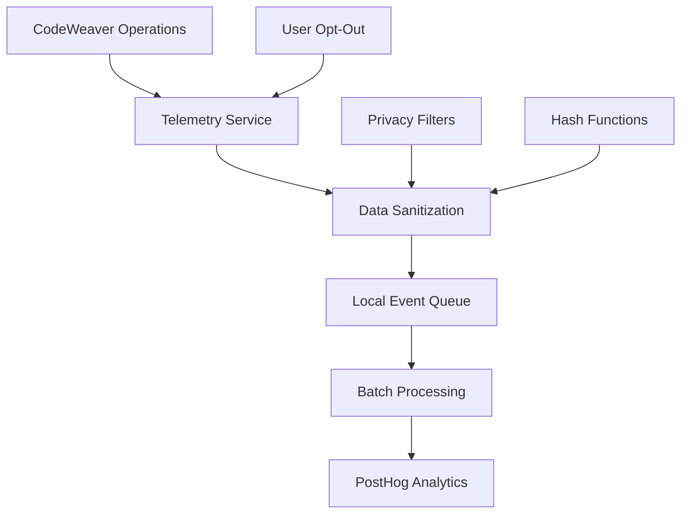

<!--
SPDX-FileCopyrightText: 2025 Knitli Inc.
SPDX-FileContributor: Adam Poulemanos <adam@knit.li>

SPDX-License-Identifier: MIT OR Apache-2.0
-->

# Telemetry System Architecture

CodeWeaver implements a comprehensive, privacy-first telemetry system built on PostHog with extensive data sanitization and user control mechanisms.

## System Architecture

### High-Level Data Flow



### Core Components

#### 1. Telemetry Service (`services/providers/telemetry.py`)

The central telemetry service manages all analytics operations:

```python
from codeweaver.services.providers.telemetry import TelemetryProvider

# Service initialization with privacy-first defaults
telemetry_config = TelemetryServiceConfig(
    enabled=True,
    anonymous_tracking=True,
    hash_file_paths=True,
    hash_repository_names=True,
    sanitize_queries=True,
    collect_sensitive_data=False,
)
```

#### 2. Event Collection Pipeline

Events flow through multiple privacy-preserving stages:

1. **Event Generation**: Operations trigger telemetry events
2. **Privacy Filtering**: Sensitive data is removed or hashed
3. **Local Queuing**: Events are batched locally for efficiency
4. **Transmission**: Sanitized events are sent to PostHog

#### 3. Data Sanitization Engine

All data passes through comprehensive sanitization:

```python
# File path sanitization
"/Users/dev/secret-project/src/auth.py" :material-arrow-right-circle: "path_a1b2c3d4.py"

# Repository name hashing
"company/proprietary-repo" :material-arrow-right-circle: "repo_e5f6g7h8"

# Query content removal
"find authentication in user.py" :material-arrow-right-circle: "query_type:semantic, complexity:medium"
```

## Privacy Protection Mechanisms

### 1. Anonymous User Identification

Users are identified through session-specific hashed IDs:

```python
# Session-based anonymous ID generation
import hashlib
import uuid

session_id = str(uuid.uuid4())
anonymous_id = hashlib.sha256(f"{session_id}_{installation_id}".encode()).hexdigest()[:16]
```

### 2. Path and Repository Hashing

Sensitive path information is consistently hashed:

```python
def hash_file_path(file_path: str) -> str:
    """Convert file paths to privacy-safe identifiers."""
    path_parts = Path(file_path).parts
    hashed_parts = []

    for part in path_parts[:-1]:  # Hash directories
        if part not in SAFE_DIRS:
            hashed_parts.append(f"dir_{hash_string(part)[:8]}")
        else:
            hashed_parts.append(part)

    # Preserve file extension for language analysis
    filename = path_parts[-1]
    name, ext = os.path.splitext(filename)
    hashed_name = f"file_{hash_string(name)[:8]}{ext}"
    hashed_parts.append(hashed_name)

    return "/".join(hashed_parts)
```

### 3. Query Content Sanitization

Search queries are analyzed for patterns while removing content:

```python
def sanitize_query(query: str) -> dict:
    """Extract patterns while removing sensitive content."""
    return {
        "query_type": detect_query_type(query),
        "complexity": assess_complexity(query),
        "has_file_filter": "file:" in query,
        "has_language_filter": "lang:" in query,
        "word_count": len(query.split()),
        "has_regex": bool(re.search(r'[.*+?^${}()|[\]\\]', query)),
        # Original query content is NOT included
    }
```

## Event Types and Data Models

### 1. Indexing Events

Track codebase indexing operations:

```python
{
    "event": "codebase_indexed",
    "properties": {
        "repository_hash": "repo_a1b2c3d4",
        "file_count": 1247,
        "language_distribution": {
            "python": 0.45,
            "typescript": 0.30,
            "javascript": 0.15,
            "other": 0.10
        },
        "processing_time_ms": 5420,
        "success": True,
        "total_size_mb": 12.3,
        "ast_grep_available": True
    }
}
```

### 2. Search Events

Track search operations and performance:

```python
{
    "event": "search_performed",
    "properties": {
        "search_type": "semantic",  # or "ast_grep"
        "query_complexity": "medium",
        "result_count": 15,
        "search_latency_ms": 340,
        "filters_used": ["file_type", "language"],
        "repository_hash": "repo_a1b2c3d4",
        "success": True,
        "relevance_score_avg": 0.75
    }
}
```

### 3. Performance Events

Monitor system performance and health:

```python
{
    "event": "performance_metric",
    "properties": {
        "operation": "semantic_search",
        "duration_ms": 340,
        "memory_usage_mb": 45.2,
        "cpu_usage_percent": 12.5,
        "cache_hit_rate": 0.68,
        "backend_latency_ms": 120,
        "embedding_latency_ms": 85
    }
}
```

### 4. Error Events

Track errors for debugging and improvement:

```python
{
    "event": "error_occurred",
    "properties": {
        "error_type": "EmbeddingProviderError",
        "error_category": "network",
        "operation": "semantic_search",
        "recovery_successful": True,
        "fallback_used": "local_cache",
        "impact_level": "low"  # low, medium, high, critical
    }
}
```

## Configuration Options

### Environment Variables

All telemetry settings support environment variable configuration:

```bash
# Basic controls
export CW_TELEMETRY_ENABLED=true
export CW_TELEMETRY_ANONYMOUS_TRACKING=true
export CW_NO_TELEMETRY=false  # Alternative disable method

# PostHog configuration
export CW_TELEMETRY_API_KEY="your_posthog_key"
export CW_TELEMETRY_HOST="https://app.posthog.com"

# Privacy controls
export CW_TELEMETRY_HASH_FILE_PATHS=true
export CW_TELEMETRY_HASH_REPOSITORY_NAMES=true
export CW_TELEMETRY_SANITIZE_QUERIES=true
export CW_TELEMETRY_COLLECT_SENSITIVE_DATA=false

# Event filtering
export CW_TELEMETRY_TRACK_INDEXING=true
export CW_TELEMETRY_TRACK_SEARCH=true
export CW_TELEMETRY_TRACK_ERRORS=true
export CW_TELEMETRY_TRACK_PERFORMANCE=true

# Performance settings
export CW_TELEMETRY_BATCH_SIZE=50
export CW_TELEMETRY_FLUSH_INTERVAL=30.0
export CW_TELEMETRY_MAX_QUEUE_SIZE=1000
```

### Configuration File

Complete TOML configuration:

```toml
[telemetry]
# Core settings
enabled = true
anonymous_tracking = true
provider = "posthog_telemetry"

# PostHog connection
api_key = "your_posthog_key"
host = "https://app.posthog.com"

# Privacy protection
hash_file_paths = true
hash_repository_names = true
sanitize_queries = true
collect_sensitive_data = false

# Event types to track
track_indexing = true
track_search = true
track_errors = true
track_performance = true

# Performance tuning
batch_size = 50
flush_interval = 30.0
max_queue_size = 1000

# Development settings
mock_mode = false  # Set to true for testing
debug_logging = false
```

## Opt-Out Mechanisms

### 1. Complete Disable

Multiple ways to disable telemetry entirely:

```bash
# Environment variable (immediate effect)
export CW_TELEMETRY_ENABLED=false

# Alternative environment variable
export CW_NO_TELEMETRY=true

# Configuration file
echo '[telemetry]\nenabled = false' >> ~/.config/codeweaver/config.toml
```

### 2. Runtime Control

Disable telemetry programmatically:

```python
from codeweaver.services.manager import ServicesManager

# Get telemetry service and disable
services_manager = ServicesManager(config)
telemetry_service = services_manager.get_telemetry_service()

if telemetry_service:
    telemetry_service.set_enabled(enabled=False)
    await telemetry_service.flush_events()  # Send any queued events
```

### 3. Selective Event Filtering

Control specific event types:

```python
# Disable only search tracking
telemetry_config = TelemetryServiceConfig(
    enabled=True,
    track_indexing=True,
    track_search=False,    # Disable search tracking
    track_errors=True,
    track_performance=True
)
```

## Privacy Information API

Check current telemetry status and privacy settings:

```python
# Get comprehensive privacy information
privacy_info = telemetry_service.get_privacy_info()

print(f"Telemetry enabled: {privacy_info['enabled']}")
print(f"Anonymous tracking: {privacy_info['anonymous_tracking']}")
print(f"Data sanitization: {privacy_info['sanitization_enabled']}")
print(f"Opt-out methods: {privacy_info['opt_out_methods']}")
```

Example privacy info response:

```json
{
    "enabled": true,
    "anonymous_tracking": true,
    "sanitization_enabled": true,
    "data_collected": [
        "query_patterns",
        "performance_metrics",
        "error_categories",
        "language_usage"
    ],
    "data_protected": [
        "file_contents",
        "repository_names",
        "search_queries",
        "personal_information"
    ],
    "opt_out_methods": [
        "CW_TELEMETRY_ENABLED=false",
        "CW_NO_TELEMETRY=true",
        "config_file_setting",
        "runtime_api"
    ],
    "retention_period": "90_days",
    "data_sharing": "none"
}
```

## Performance Impact

Telemetry is designed for minimal performance impact:

- **Memory**: <5MB additional memory usage
- **CPU**: <1% CPU overhead during normal operations
- **Network**: Batched transmission reduces network calls
- **Storage**: Local queue limited to 1MB maximum

### Benchmarks

| Operation | Without Telemetry | With Telemetry | Overhead |
|-----------|------------------|----------------|----------|
| Semantic Search | 340ms | 342ms | +2ms (0.6%) |
| Codebase Indexing | 5.2s | 5.3s | +100ms (1.9%) |
| AST Grep Search | 45ms | 46ms | +1ms (2.2%) |

## Troubleshooting

### Common Issues

#### Telemetry Not Working
```bash
# Check configuration
codeweaver config telemetry status

# Enable debug logging
export CW_TELEMETRY_DEBUG=true
```

#### High Memory Usage
```bash
# Reduce batch size and queue
export CW_TELEMETRY_BATCH_SIZE=25
export CW_TELEMETRY_MAX_QUEUE_SIZE=500
```

#### Network Issues
```bash
# Increase flush interval for unreliable networks
export CW_TELEMETRY_FLUSH_INTERVAL=60.0

# Enable mock mode for offline development
export CW_TELEMETRY_MOCK_MODE=true
```

### Debug Mode

Enable comprehensive telemetry debugging:

```python
# Enable debug logging
telemetry_config = TelemetryServiceConfig(
    enabled=True,
    debug_logging=True,
    mock_mode=True  # For testing without sending data
)
```

## Security Considerations

- **API Key Protection**: PostHog API keys should be treated as secrets
- **Network Security**: All telemetry data transmitted over HTTPS
- **Local Storage**: Event queue stored in secure temporary directories
- **Data Encryption**: All data encrypted in transit and at rest
- **Access Control**: No administrative access to user telemetry data

---

*This telemetry system prioritizes user privacy while providing valuable insights to improve CodeWeaver for all developers.*
