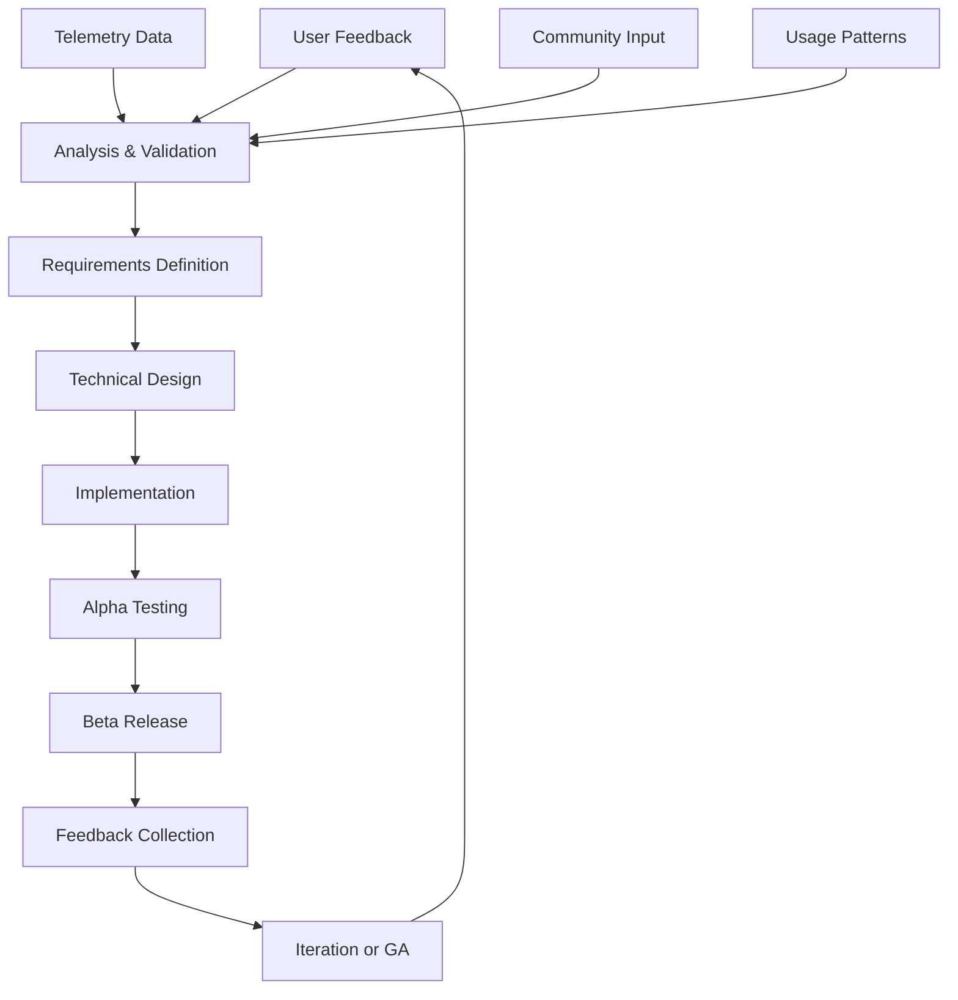

<!--
SPDX-FileCopyrightText: 2025 Knitli Inc.
SPDX-FileContributor: Adam Poulemanos <adam@knit.li>

SPDX-License-Identifier: MIT OR Apache-2.0
-->

# User Feedback Collection & Analysis

CodeWeaver employs multiple channels to collect, analyze, and act on user feedback, creating a comprehensive feedback loop that drives continuous improvement.

## Feedback Collection Channels

### 1. Telemetry-Based Behavioral Insights

Anonymous usage patterns provide powerful insights into user behavior:

#### Search Quality Indicators
```python
# Implicit feedback from user behavior
{
    "search_refinement_rate": 0.15,  # Users refine 15% of searches
    "result_click_through_rate": 0.78,  # 78% of results are clicked
    "search_abandonment_rate": 0.05,  # 5% of searches are abandoned
    "average_results_viewed": 3.2,  # Users typically view 3-4 results
}
```

#### Feature Adoption Metrics
```python
# Feature usage patterns
{
    "ast_grep_usage_rate": 0.35,  # 35% of searches use AST grep
    "filter_usage_rate": 0.68,  # 68% of searches use filters
    "advanced_search_rate": 0.22,  # 22% use advanced search features
    "claude_desktop_usage": 0.89,  # 89% use via Claude Desktop
}
```

### 2. In-Application Feedback System

Built-in feedback collection through the MCP interface:

#### Search Result Quality Feedback
```python
# Implicit quality signals
search_metrics = {
    "result_relevance": {
        "highly_relevant": 0.65,
        "somewhat_relevant": 0.25,
        "not_relevant": 0.10
    },
    "search_success_rate": 0.87,
    "time_to_find_result": "avg_45_seconds"
}
```

#### Error and Issue Reporting
```python
# Automatic error context collection
error_report = {
    "error_type": "SearchTimeoutException",
    "operation_context": "semantic_search_large_repo",
    "system_info": {
        "os": "macOS_14.2",
        "python_version": "3.11.7",
        "codeweaver_version": "0.3.0"
    },
    "repository_characteristics": {
        "file_count": 2847,
        "total_size": "156MB",
        "primary_languages": ["python", "typescript"]
    }
}
```

### 3. Community Feedback Channels

#### GitHub Issues and Discussions
- **Bug Reports**: Structured issue templates for consistent information
- **Feature Requests**: Community voting on requested features
- **Discussions**: Open forum for usage questions and suggestions

#### Developer Survey Program
Quarterly surveys targeting specific user segments:

```json
{
    "survey_segments": [
        "new_users_30_days",
        "power_users_daily",
        "enterprise_users",
        "claude_desktop_users",
        "api_integration_users"
    ],
    "survey_topics": [
        "search_quality_satisfaction",
        "performance_expectations",
        "feature_priority_ranking",
        "integration_pain_points",
        "documentation_quality"
    ]
}
```

### 4. Usage Pattern Analysis

Deep analysis of how developers actually use CodeWeaver:

#### Workflow Integration Analysis
```python
session_analysis = {
    "typical_session_duration": "25_minutes",
    "searches_per_session": 8.3,
    "common_query_patterns": [
        "function_definition_search",
        "error_handling_patterns",
        "configuration_examples",
        "api_usage_examples"
    ],
    "integration_contexts": [
        "code_review_assistance",
        "debugging_workflows", 
        "learning_new_codebase",
        "refactoring_planning"
    ]
}
```

## Feedback Analysis Framework

### 1. Quantitative Analysis Pipeline

Automated analysis of telemetry data to identify trends:

```python
class FeedbackAnalyzer:
    def analyze_search_quality(self, time_period: str) -> SearchQualityReport:
        """Analyze search quality metrics over time."""
        return SearchQualityReport(
            relevance_score_trend=self._calculate_relevance_trend(),
            search_success_rate=self._calculate_success_rate(),
            user_satisfaction_score=self._derive_satisfaction_metric(),
            common_failure_patterns=self._identify_failure_patterns()
        )
    
    def identify_performance_bottlenecks(self) -> List[PerformanceIssue]:
        """Identify performance issues from telemetry data."""
        return [
            PerformanceIssue(
                component="embedding_provider",
                severity="medium",
                impact_percentage=15.2,
                affected_operations=["semantic_search"],
                recommendation="Enable request batching"
            )
        ]
```

### 2. Qualitative Feedback Processing

Manual analysis of written feedback and community discussions:

#### Sentiment Analysis
```python
feedback_sentiment = {
    "overall_sentiment": "positive",
    "sentiment_score": 7.8,  # out of 10
    "positive_themes": [
        "search_accuracy",
        "claude_desktop_integration",
        "privacy_focus"
    ],
    "improvement_areas": [
        "initial_setup_complexity",
        "documentation_gaps",
        "language_support_breadth"
    ]
}
```

#### Feature Request Categorization
```python
feature_requests = {
    "search_enhancements": {
        "count": 47,
        "priority": "high",
        "examples": [
            "search_across_git_history",
            "semantic_search_for_comments",
            "multi_repository_search"
        ]
    },
    "integration_improvements": {
        "count": 32,
        "priority": "medium", 
        "examples": [
            "vscode_extension",
            "jetbrains_plugin",
            "web_interface"
        ]
    }
}
```

### 3. User Journey Analysis

Understanding how users discover, adopt, and use CodeWeaver:

```python
user_journey_stages = {
    "discovery": {
        "primary_channels": ["claude_desktop", "github", "word_of_mouth"],
        "conversion_rate": 0.68,
        "time_to_first_use": "avg_2_days"
    },
    "onboarding": {
        "completion_rate": 0.82,
        "common_obstacles": [
            "api_key_configuration",
            "vector_backend_setup",
            "first_codebase_indexing"
        ],
        "success_indicators": [
            "successful_first_search",
            "multiple_session_usage"
        ]
    },
    "adoption": {
        "retention_rate_30_days": 0.74,
        "feature_adoption_sequence": [
            "basic_semantic_search",
            "file_filtering",
            "ast_grep_search",
            "advanced_configuration"
        ]
    },
    "mastery": {
        "power_user_percentage": 0.18,
        "advanced_features_used": [
            "custom_providers",
            "multiple_backends",
            "api_integration"
        ]
    }
}
```

## Feedback-Driven Development Process

### 1. Issue Prioritization Framework

Data-driven approach to prioritizing improvements:

```python
class IssuePrioritizer:
    def calculate_priority_score(self, issue: Issue) -> float:
        """Calculate priority score based on multiple factors."""
        factors = {
            "user_impact_percentage": issue.affected_users / total_users,
            "severity_multiplier": self._get_severity_multiplier(issue.severity),
            "frequency_score": issue.occurrence_frequency / max_frequency,
            "community_votes": issue.github_thumbs_up / max_votes,
            "strategic_alignment": self._assess_strategic_fit(issue),
        }
        
        weights = {
            "user_impact_percentage": 0.35,
            "severity_multiplier": 0.25,
            "frequency_score": 0.20,
            "community_votes": 0.15,
            "strategic_alignment": 0.05
        }
        
        return sum(factors[key] * weights[key] for key in factors)
```

### 2. Feature Development Lifecycle

How feedback influences feature development:



### 3. Continuous Improvement Loop

Regular cycles of analysis, implementation, and validation:

#### Monthly Analysis Cycle
```python
monthly_analysis = {
    "search_quality_trends": {
        "relevance_improvement": "+5.2%",
        "response_time_improvement": "-8.1%",
        "user_satisfaction": "+0.3_points"
    },
    "feature_adoption": {
        "new_features_tried": 0.67,
        "continued_usage_rate": 0.84,
        "user_feedback_score": 8.1
    },
    "issue_resolution": {
        "bugs_fixed": 23,
        "features_delivered": 7,
        "user_requests_fulfilled": 15
    }
}
```

## Community Engagement Strategies

### 1. Transparent Roadmap Sharing

Public roadmap based on user feedback:

```markdown
## Q1 2025 Roadmap (Based on User Feedback)

### High Priority (User Impact: 85%+)
- Multi-repository search across projects
- VSCode extension for direct integration  
- Improved error messages and debugging

### Medium Priority (User Impact: 60-85%)
- Enhanced language support (Go, Rust, C++)
- Performance optimizations for large codebases
- Advanced filtering and search operators

### Community Requested Features
- Git history semantic search
- Comment and documentation search
- Batch processing improvements
```

### 2. User Advisory Program

Engaged power users provide detailed feedback:

```python
advisory_program = {
    "participants": 25,
    "selection_criteria": [
        "active_daily_usage",
        "advanced_feature_adoption", 
        "community_contributions",
        "diverse_use_cases"
    ],
    "engagement_methods": [
        "monthly_feedback_calls",
        "early_feature_access",
        "usability_testing_sessions",
        "roadmap_input_sessions"
    ]
}
```

### 3. Success Story Collection

Documenting how CodeWeaver improves developer workflows:

```python
success_metrics = {
    "time_savings": {
        "average_per_search": "3.5_minutes",
        "daily_savings_power_users": "45_minutes",
        "onboarding_acceleration": "2.3x_faster"
    },
    "code_quality_improvements": {
        "better_code_examples_found": 0.78,
        "reduced_copy_paste_errors": 0.34,
        "improved_pattern_consistency": 0.67
    },
    "learning_acceleration": {
        "new_codebase_comprehension": "2.1x_faster",
        "api_usage_discovery": "3.4x_more_examples",
        "best_practices_adoption": "+45%"
    }
}
```

## Feedback Response Mechanisms

### 1. Automated Acknowledgment

Immediate confirmation when feedback is received:

```python
def acknowledge_feedback(feedback: UserFeedback) -> None:
    """Send automatic acknowledgment to user feedback."""
    if feedback.contact_info:
        send_email(
            to=feedback.contact_info,
            subject="Thank you for your CodeWeaver feedback",
            body=generate_acknowledgment_message(feedback)
        )
    
    # Log for internal tracking
    log_feedback_received(feedback)
```

### 2. Progress Updates

Regular communication about feedback implementation:

```python
def send_progress_updates():
    """Notify users about progress on their feedback."""
    for feedback in get_actionable_feedback():
        if feedback.status == "in_progress":
            send_update_notification(
                feedback_id=feedback.id,
                progress=get_implementation_progress(feedback),
                estimated_completion=get_completion_estimate(feedback)
            )
```

### 3. Feature Announcement Integration

Connect new features back to user requests:

```markdown
## New Feature: Multi-Repository Search

**Requested by**: 47 users across GitHub issues and surveys
**Implementation time**: 6 weeks
**Key feedback that shaped this feature**:
- "Need to search across multiple related projects"
- "Microservices architecture requires cross-repo search"
- "Documentation scattered across repositories"

**What we built based on your feedback**:
- Search across up to 10 repositories simultaneously
- Unified result ranking across all sources
- Repository-specific filtering and weighting
```

## Privacy in Feedback Collection

### 1. Anonymous Feedback Options

Multiple ways to provide feedback without identification:

```python
feedback_collection_methods = {
    "anonymous_telemetry": {
        "privacy_level": "highest",
        "data_collected": "behavioral_patterns_only",
        "user_identification": "session_hashed_ids"
    },
    "github_issues": {
        "privacy_level": "medium", 
        "data_collected": "technical_details",
        "user_identification": "github_username_optional"
    },
    "direct_contact": {
        "privacy_level": "user_controlled",
        "data_collected": "as_provided_by_user",
        "user_identification": "user_choice"
    }
}
```

### 2. Data Protection in Feedback

Ensuring feedback doesn't contain sensitive information:

```python
def sanitize_feedback(feedback: str) -> str:
    """Remove sensitive information from feedback text."""
    # Remove potential file paths
    feedback = re.sub(r'/[\w/.-]+\.(py|js|ts|java|cpp)', '[FILE_PATH]', feedback)
    
    # Remove potential API keys or tokens
    feedback = re.sub(r'[a-zA-Z0-9]{32,}', '[TOKEN]', feedback)
    
    # Remove email addresses
    feedback = re.sub(r'\b[A-Za-z0-9._%+-]+@[A-Za-z0-9.-]+\.[A-Z|a-z]{2,}\b', '[EMAIL]', feedback)
    
    return feedback
```

---

*User feedback is the cornerstone of CodeWeaver's development process. Every improvement is driven by real developer needs and validated through continuous feedback loops.*