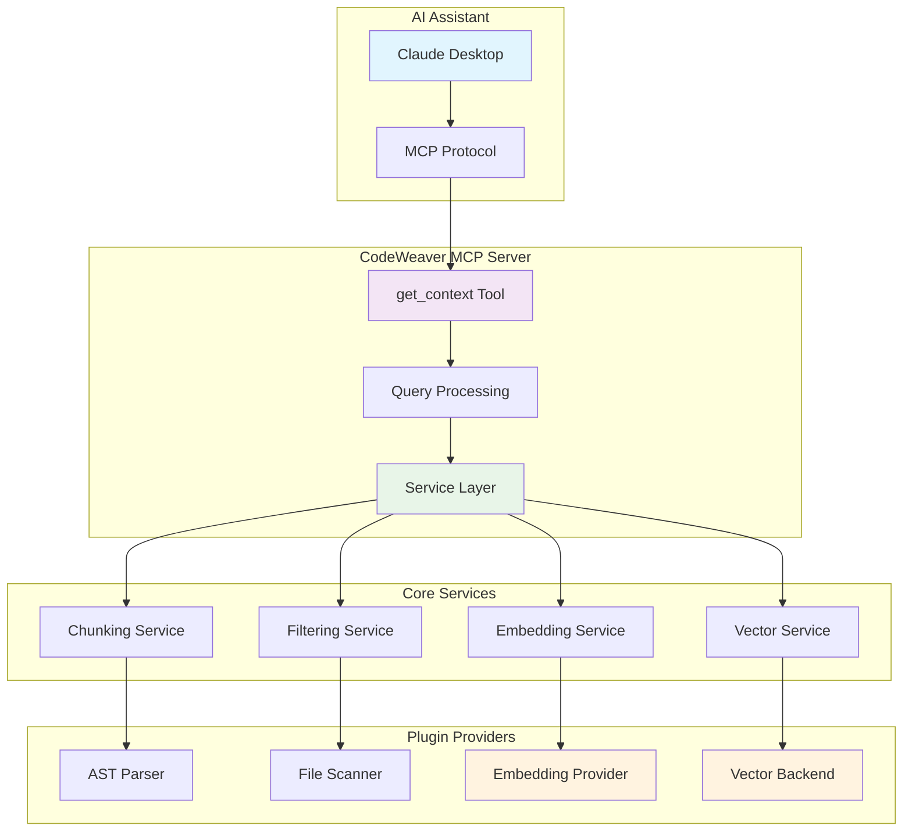

<!--
SPDX-FileCopyrightText: 2025 Knitli Inc.

SPDX-License-Identifier: MIT OR Apache-2.0
-->

# Architecture Overview

CodeWeaver's architecture is designed for extensibility and performance. It provides semantic and traditional code search through a plugin-based system with multiple provider and backend options.

## High-Level Architecture



## Core Components

### MCP Server
The main server implements the Model Context Protocol and exposes tools for AI assistants:
- **get_context**: Natural language interface for code exploration
- **get_context_capabilities**: Discover available features and capabilities

### Query Processing Engine
Converts natural language queries into structured operations:
- **Intent classification**: Understand what the user wants to accomplish
- **Query planning**: Determine optimal search strategy
- **Result synthesis**: Combine multiple data sources into coherent responses

### Service Layer
Coordinates core functionality through pluggable services:
- **Dependency injection**: Runtime service resolution
- **Lifecycle management**: Service initialization and cleanup
- **Health monitoring**: Service status and performance tracking
- **Configuration management**: Hierarchical configuration system

## Plugin Architecture

### Factory Pattern
CodeWeaver uses the factory pattern for component creation and management:

```python
# Example: Creating embedding providers
embedding_provider = factory.create_embedding_provider(
    provider_type="voyage",
    config=VoyageConfig(api_key="...")
)

# Example: Creating vector backends
vector_backend = factory.create_vector_backend(
    backend_type="qdrant",
    config=QdrantConfig(url="...", api_key="...")
)
```

### Plugin Types

**Embedding Providers:**
- Voyage AI (recommended for code)
- OpenAI (ada-002, text-embedding-3-small/large)
- Cohere (embed-english-v3.0, embed-multilingual-v3.0)
- HuggingFace (sentence-transformers, custom models)

**Vector Backends:**
- Qdrant (recommended for performance)
- Pinecone (managed cloud service)
- Weaviate (open source with GraphQL)
- ChromaDB (lightweight, embedded option)

**Data Sources:**
- Filesystem (local files and directories)
- Git repositories (with history and branch support)
- Database connections (structured data sources)
- API endpoints (remote data retrieval)

### Extension Points

Developers can extend CodeWeaver by implementing protocol interfaces:

```python
# Custom embedding provider
class CustomEmbeddingProvider(EmbeddingProvider):
    async def embed_texts(self, texts: list[str]) -> list[list[float]]:
        # Your embedding logic here
        pass

# Custom vector backend
class CustomVectorBackend(VectorBackend):
    async def store_vectors(self, vectors: list[VectorPoint]) -> None:
        # Your storage logic here
        pass

    async def search_vectors(self, query_vector: list[float], limit: int) -> list[SearchResult]:
        # Your search logic here
        pass
```

## Processing Pipeline

### 1. Query Input
AI assistant sends natural language query through MCP protocol:
```plaintext
"Find authentication functions in /path/to/project"
```

### 2. Intent Processing
Query processor analyzes intent and plans execution:
- Identify target: authentication-related code
- Determine scope: specified directory path
- Select strategy: semantic search + structural patterns

### 3. Code Discovery
Filtering service discovers relevant files:
- Scan directory structure
- Apply gitignore rules
- Filter by file type and size
- Detect programming languages

### 4. Content Chunking
Chunking service segments code intelligently:
- Parse files using AST when available
- Respect semantic boundaries (functions, classes, modules)
- Create appropriately-sized chunks for embedding
- Preserve context and metadata

### 5. Embedding Generation
Embedding service converts text to vectors:
- Batch process chunks for efficiency
- Use provider-specific optimizations
- Handle rate limiting and retries
- Cache results for performance

### 6. Vector Storage
Vector service stores embeddings with metadata:
- Create/update collections as needed
- Store vectors with associated metadata
- Index for efficient similarity search
- Handle concurrent access

### 7. Semantic Search
Vector service performs similarity search:
- Convert query to embedding vector
- Search for similar code chunks
- Apply metadata filters
- Rank and score results

### 8. Result Synthesis
Query processor combines and formats results:
- Aggregate results from multiple sources
- Add context and explanations
- Format for AI assistant consumption
- Include relevant metadata

## Configuration System

### Hierarchical Configuration
Configuration comes from multiple sources in priority order:
1. Environment variables (highest priority)
2. Configuration files (TOML format)
3. Default values (lowest priority)

### Environment Variables
Essential configuration through environment variables:
```bash
# Embedding provider
CW_EMBEDDING_PROVIDER=voyage
CW_EMBEDDING_API_KEY=pa-your-key
CW_EMBEDDING_MODEL=voyage-code-2

# Vector backend
CW_VECTOR_BACKEND=qdrant
CW_VECTOR_BACKEND_URL=https://your-cluster.qdrant.io:6333
CW_VECTOR_BACKEND_API_KEY=your-key
CW_VECTOR_BACKEND_COLLECTION=codeweaver

# Performance tuning
CW_CHUNK_SIZE=1500
CW_BATCH_SIZE=8
CW_MAX_FILE_SIZE=1048576
```

### Configuration Files
Advanced configuration through TOML files:
```toml
[embedding]
provider = "voyage"
model = "voyage-code-2"
batch_size = 8

[vector]
backend = "qdrant"
collection = "codeweaver"
similarity_threshold = 0.7

[chunking]
max_chunk_size = 1500
min_chunk_size = 50
overlap_size = 100
```

## Performance Considerations

### Caching Strategy
Multi-level caching for optimal performance:
- **Vector cache**: Store embeddings to avoid recomputation
- **Query cache**: Cache search results for repeated queries
- **Metadata cache**: Cache file information for faster filtering

### Batch Processing
Optimize API usage through batching:
- **Embedding batches**: Process multiple chunks per API call
- **File batches**: Process multiple files concurrently
- **Search batches**: Group similar queries together

### Resource Management
Intelligent resource usage:
- **Memory limits**: Prevent excessive memory consumption
- **Rate limiting**: Respect API rate limits
- **Connection pooling**: Reuse database connections
- **Async processing**: Non-blocking I/O operations

## Security Considerations

### API Key Management
- Environment variable storage (never hardcode)
- Secure credential handling
- Provider-specific authentication methods

### Input Validation
- Path traversal prevention
- File type validation
- Content size limits
- Malicious content detection

### Data Privacy
- Local processing when possible
- Minimal data transmission
- Configurable data retention
- Audit logging capabilities

## Next Steps

- **[Extension Development](../extensions/embedding-providers.md)**: Build custom providers
- **[Configuration Guide](../configuration/environment.md)**: Advanced setup options
- **[API Reference](../api/core/factory.md)**: Technical documentation
- **[Performance Tuning](../user-guide/performance.md)**: Optimization strategies
