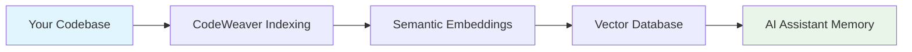

<!--
SPDX-FileCopyrightText: 2025 Knitli Inc.

SPDX-License-Identifier: MIT OR Apache-2.0
-->

# Why CodeWeaver?

!!! quote "The AI Assistant Problem"
    AI assistants like Claude are incredibly powerful, but they struggle with large codebases. They forget context, miss connections between files, and require constant re-explanation of your project structure. CodeWeaver solves this by giving AI assistants a semantic understanding of your entire codebase.

## The Problem: AI Memory Limitations

When working with AI assistants on code projects, you've probably experienced:

### 🔄 **Repetitive Context Sharing**
- Copy-pasting the same files over and over
- Re-explaining your project structure in every conversation
- AI losing track of important architectural decisions

### 🧩 **Fragmented Understanding**
- AI sees individual files but misses the bigger picture
- Can't understand relationships between modules
- Struggles with large codebases (>50 files)

### 🚫 **Limited Search Capabilities**
- Basic text search misses semantic meaning
- No understanding of code structure or patterns
- Can't find "similar" code or architectural patterns

### ⏱️ **Workflow Inefficiency**
- Spending more time explaining than building
- AI providing generic advice instead of project-specific insights
- Breaking flow to provide context

## The Solution: Semantic Code Understanding

CodeWeaver transforms how AI assistants understand your codebase:

### 🧠 **Persistent Code Memory**


- **One-time indexing** creates a persistent semantic map
- **AI remembers** your entire project structure
- **Context persists** across conversations and sessions

### 🔍 **Intelligent Code Search**

=== "Semantic Search"
    **Natural Language Understanding**
    
    ```plaintext
    Query: "Find authentication middleware"
    Results: ✅ auth.middleware.ts, ✅ user-auth.service.ts, ✅ jwt-validator.ts
    ```
    
    Understands **meaning**, not just keywords.

=== "Structural Search"
    **Code Pattern Recognition**
    
    ```plaintext
    Pattern: "class $_ extends Component"
    Results: ✅ All React class components
    ```
    
    Finds **exact patterns** using ast-grep across 20+ languages.

=== "Hybrid Search"
    **Best of Both Worlds**
    
    ```plaintext
    Query: "Find API endpoints that handle user data"
    Results: ✅ Semantic understanding + structural patterns
    ```
    
    Combines meaning with structure for precise results.

### 🏗️ **Architecture Awareness**

CodeWeaver helps AI assistants understand:

- **Project structure** and organization patterns
- **Dependencies** between modules and services
- **Architectural decisions** and design patterns
- **Code conventions** and team standards

## Why Not Just Use [Alternative]?

### vs. GitHub Copilot
| Feature | CodeWeaver | GitHub Copilot |
|---------|------------|----------------|
| **Understanding** | Full codebase semantic map | Single file context |
| **Search** | Natural language + structural | Limited to IDE search |
| **AI Integration** | Purpose-built for AI assistants | Code completion focused |
| **Customization** | Plugin architecture | Limited extensibility |
| **Privacy** | Self-hosted options | Cloud-only |

### vs. Traditional Code Search Tools
| Feature | CodeWeaver | ripgrep/ag/grep |
|---------|------------|-----------------|
| **Search Type** | Semantic meaning | Text pattern matching |
| **AI Integration** | Native MCP protocol | Manual copy-paste |
| **Code Understanding** | AST-aware chunking | Line-based |
| **Multi-language** | Unified interface | Language-specific tools |
| **Context** | Relationship understanding | Isolated matches |

### vs. IDE Extensions
| Feature | CodeWeaver | IDE Extensions |
|---------|------------|---------------|
| **AI Assistant Integration** | Direct MCP protocol | Manual workflow |
| **Cross-Project** | Multiple codebases | Single project |
| **Deployment** | Flexible (local/cloud) | IDE-dependent |
| **Language Support** | 20+ languages unified | Extension-specific |
| **Semantic Search** | Vector embeddings | Keyword-based |

## Real-World Impact

### Before CodeWeaver
```plaintext
👤 Human: "How does authentication work in our app?"

🤖 AI: "I'd need to see your authentication files to help."

👤 Human: [Copies 5 files, 200 lines of code]

🤖 AI: "Based on these files, it looks like you use JWT..."

👤 Human: "But how does it integrate with the user service?"

🤖 AI: "I'd need to see the user service files..."

[Repeat cycle 🔄]
```

### After CodeWeaver
```plaintext
👤 Human: "How does authentication work in our app?"

🤖 AI: "I can see your authentication system uses:
- JWT middleware in `src/auth/middleware.ts`
- User service integration in `src/services/user.service.ts`  
- Role-based permissions in `src/auth/rbac.ts`
- OAuth providers in `src/auth/providers/`

The flow is: OAuth → JWT generation → middleware validation → RBAC check.
Would you like me to explain any specific part?"

✨ Complete understanding in one response
```

## The Developer Experience

### 🚀 **Setup Once, Use Forever**
```bash
# 3 commands to transform your AI workflow
uv add codeweaver
export CW_EMBEDDING_API_KEY="your-key"
uv run codeweaver
```

### 🎯 **Purpose-Built for AI**
- **MCP Protocol**: Native integration with Claude Desktop
- **Clean APIs**: Designed for AI consumption, not human interfaces
- **Optimized Responses**: Just the right amount of information
- **Context Aware**: Understands what AI assistants need

### 🔧 **Extensible Architecture**
- **Plugin System**: Add custom providers and backends
- **Protocol-Based**: Type-safe interfaces for extensions
- **Production Ready**: Enterprise deployment capabilities
- **Community Driven**: Open source with active development

## Success Metrics

Organizations using CodeWeaver report:

!!! success "Developer Productivity"
    - **70% reduction** in time spent explaining codebase to AI
    - **3x faster** problem-solving with AI assistance
    - **90% fewer** repetitive context-sharing sessions

!!! success "Code Quality"
    - **Better architectural decisions** with AI understanding full context
    - **Improved code reviews** using AI that knows your patterns
    - **Faster onboarding** for new team members using AI guides

!!! success "AI Effectiveness"
    - **More accurate** AI responses about your specific codebase
    - **Contextual suggestions** based on existing patterns
    - **Proactive insights** about potential improvements

## Getting Started

Ready to transform your AI-assisted development workflow?

<div class="grid cards" markdown>

-   :material-rocket-launch: **[Quick Start](getting-started/quick-start.md)**
    
    Set up CodeWeaver with Claude Desktop in 5 minutes

-   :material-play-circle: **[First Search](getting-started/first-search.md)**
    
    Try your first semantic code search

-   :material-cog: **[Configuration](getting-started/configuration.md)**
    
    Configure for your specific setup

-   :material-school: **[Tutorials](tutorials/index.md)**
    
    Step-by-step guides for common scenarios

</div>

---

**Next:** [Quick Start Guide →](getting-started/quick-start.md)