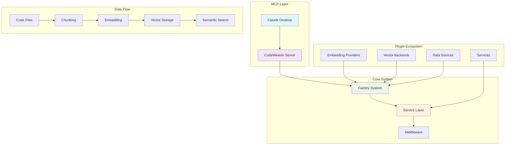

<!--
SPDX-FileCopyrightText: 2025 Knitli Inc.

SPDX-License-Identifier: MIT OR Apache-2.0
-->

# CodeWeaver Documentation

!!! tip "AI-First Documentation"
    This documentation is optimized for both human readers and AI assistants. Whether you're integrating CodeWeaver with Claude Desktop or building custom plugins, you'll find clear, actionable guidance.

**Extensible semantic code search with plugin architecture**

CodeWeaver is a next-generation Model Context Protocol (MCP) server that revolutionizes how AI assistants understand and navigate codebases. Built on an extensible plugin architecture, it provides semantic code search through your choice of embedding providers, vector databases, and data sources.

## 🎯 Who Is This For?

=== "AI Assistant Users"
    **Get AI that truly understands your codebase**
    
    - Set up CodeWeaver with Claude Desktop in minutes
    - Search your code using natural language
    - Let AI answer questions about your entire project
    - No more repeatedly explaining your codebase structure
    
    → [Quick Start](getting-started/quick-start.md) | [MCP Integration](user-guide/mcp-integration.md)

=== "Developer Teams"
    **Scale code understanding across your team**
    
    - Index large monorepos and multi-language projects
    - Configure for your exact tech stack and preferences
    - Deploy on-premise or cloud with enterprise features
    - Integrate with CI/CD and development workflows
    
    → [Configuration Guide](configuration/index.md) | [Enterprise Setup](tutorials/enterprise-setup.md)

=== "Plugin Developers"
    **Extend CodeWeaver for your needs**
    
    - Build custom embedding providers and vector backends
    - Create specialized data sources and services
    - Leverage protocol-based interfaces and factory patterns
    - Access comprehensive testing and validation tools
    
    → [Plugin Development](plugins/index.md) | [Architecture Guide](architecture/index.md)

## ✨ What Makes CodeWeaver Special

### 🔌 **True Extensibility**
Plugin architecture with hot-swappable components. Mix and match providers without changing a single line of code.

### 🧠 **Universal Provider Support**
Best-in-class embedding providers: Voyage AI, OpenAI, Cohere, HuggingFace, or bring your own.

### 🏗️ **Enterprise Architecture**
Factory patterns, protocol-based interfaces, comprehensive testing, and production-ready deployment.

### 🔍 **Dual Search Modes**
- **Semantic**: "Find authentication middleware" → Understands meaning and context
- **Structural**: `"class $_ extends $$$_"` → Exact patterns using ast-grep

### ⚡ **AI-Optimized**
Purpose-built for AI assistants. Clean APIs, intelligent chunking, and context-aware responses.

## 🚀 Quick Start

Get up and running in 3 steps:

```bash
# 1. Install CodeWeaver
uv add codeweaver

# 2. Set your API keys
export CW_EMBEDDING_API_KEY="your-voyage-key"
export CW_VECTOR_BACKEND_URL="your-qdrant-url"

# 3. Run the server
uv run codeweaver
```

→ [Detailed Installation Guide](getting-started/installation.md)

## 📚 Popular Guides

<div class="grid cards" markdown>

-   :material-rocket-launch: **[Quick Start](getting-started/quick-start.md)**
    
    Get CodeWeaver running with Claude Desktop in under 5 minutes
    
-   :material-search-web: **[Search Strategies](user-guide/search-strategies.md)**
    
    Master semantic and structural search techniques
    
-   :material-cog: **[Configuration](configuration/config-file.md)**
    
    Configure providers, backends, and advanced settings
    
-   :material-puzzle: **[Plugin Development](plugins/getting-started.md)**
    
    Build custom providers and extend CodeWeaver
    
-   :material-api: **[API Reference](api/index.md)**
    
    Complete reference for MCP tools and core APIs
    
-   :material-school: **[Tutorials](tutorials/index.md)**
    
    Step-by-step guides for common use cases

</div>

## 🏛️ Architecture at a Glance



CodeWeaver's modular architecture enables:

- **Protocol-based interfaces** for type-safe extensibility
- **Factory pattern** for runtime component discovery
- **Service layer** with dependency injection and health monitoring
- **Middleware system** for cross-cutting concerns

→ [Learn more about the architecture](architecture/index.md)

## 🌟 Success Stories

!!! success "Large Monorepo Success"
    "CodeWeaver indexes our 2M+ line TypeScript monorepo in minutes. Claude now understands our entire codebase structure and can answer complex questions about cross-service dependencies."
    
    — Senior Engineering Manager, Fortune 500 Company

!!! success "Multi-Language Support"
    "We have Python, Go, TypeScript, and Rust services. CodeWeaver's ast-grep integration provides structural search across all languages with a unified interface."
    
    — Platform Engineering Lead, AI Startup

!!! success "Enterprise Deployment"
    "Self-hosted on our Kubernetes cluster with custom embedding models. The plugin architecture let us integrate our internal code analysis tools seamlessly."
    
    — DevOps Architect, Financial Services

## 🤝 Community and Support

- **[GitHub Repository](https://github.com/knitli/code-weaver-mcp)** - Source code, issues, and discussions
- **[Discord Community](https://discord.gg/codeweaver)** - Chat with users and developers
- **[Documentation](https://docs.codeweaver.dev)** - Comprehensive guides and API reference
- **[Support](community/support.md)** - Enterprise support and professional services

## 📄 License

CodeWeaver is dual-licensed under [MIT](https://opensource.org/licenses/MIT) or [Apache-2.0](https://opensource.org/licenses/Apache-2.0) licenses. Use whichever works best for your project.

---

**Ready to get started?** → [Quick Start Guide](getting-started/quick-start.md)

**Need help?** → [Community Support](community/support.md)

**Want to contribute?** → [Contributing Guide](community/contributing.md)