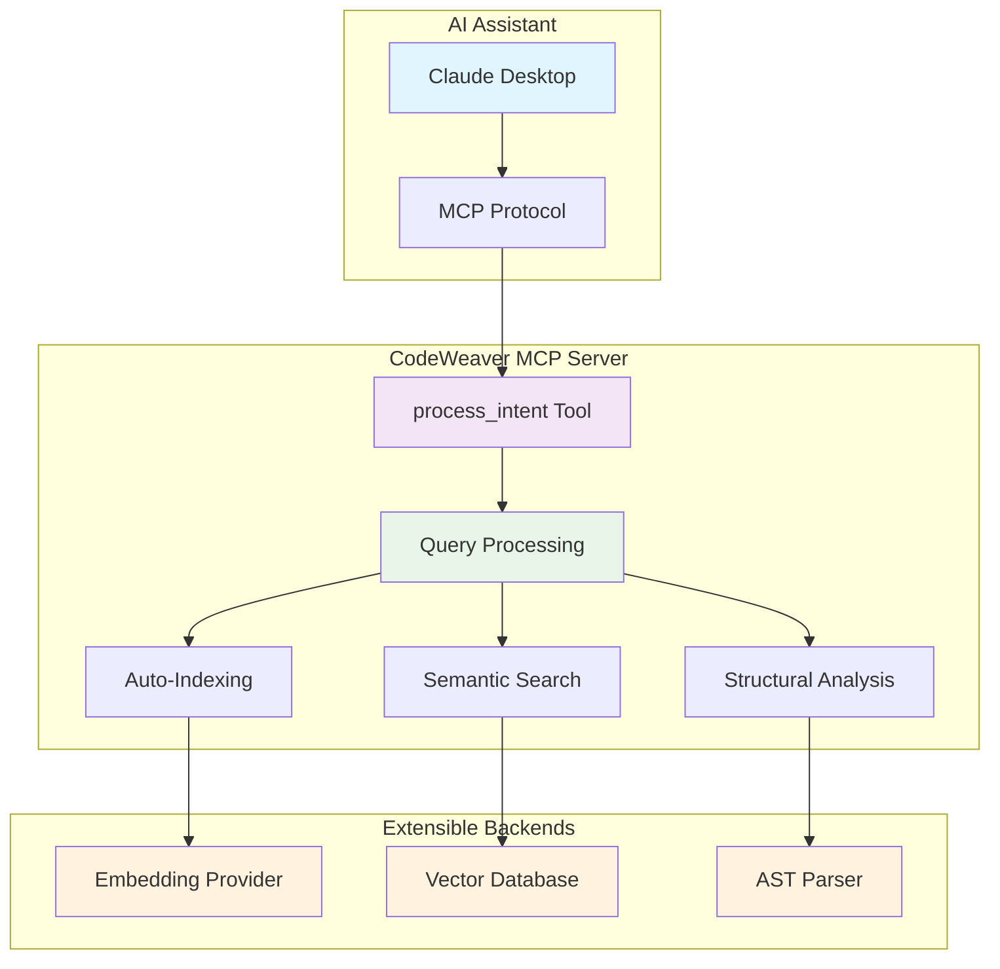

<!--
SPDX-FileCopyrightText: 2025 Knitli Inc.

SPDX-License-Identifier: MIT OR Apache-2.0
-->

# CodeWeaver

**Semantic code search MCP server for AI assistants**

CodeWeaver is a Model Context Protocol (MCP) server that provides semantic code search capabilities to AI assistants like Claude. It enables natural language exploration of codebases through intelligent indexing, vector search, and structural analysis.

## What CodeWeaver Does

CodeWeaver transforms how AI assistants interact with your code:

- **Semantic Search**: Find code by meaning, not just keywords ("authentication functions" vs. "login")
- **Automatic Indexing**: AI assistants can explore codebases without manual setup
- **Multi-Language Support**: Works across 20+ programming languages with intelligent parsing
- **Extensible Architecture**: Plugin system for custom providers, backends, and data sources

## Who Uses CodeWeaver

=== "Developers Using AI Assistants"
    **Get more from Claude Desktop and other AI tools**

    - Enhance code reviews with intelligent codebase exploration
    - Understand unfamiliar codebases quickly
    - Find related code patterns and architectural decisions
    - Accelerate debugging and feature development

    :material-arrow-right-circle: [Quick Setup](getting-started/quick-start.md)

=== "Extension Developers"
    **Build custom integrations and providers**

    - Extend embedding providers (Voyage AI, OpenAI, Cohere, custom)
    - Add vector database backends (Qdrant, Pinecone, Weaviate, custom)
    - Create specialized data sources and processing pipelines
    - Leverage protocol-based plugin architecture

    :material-arrow-right-circle: [Extension Development](architecture/index.md)

## How It Works

1. **Install and Configure**: Set up CodeWeaver as an MCP server with your AI assistant
2. **Automatic Indexing**: When AI assistants request codebase analysis, CodeWeaver intelligently indexes relevant files
3. **Semantic Search**: Natural language queries get converted to vector searches and structural patterns
4. **Intelligent Results**: Combines semantic similarity with code structure analysis for relevant results

## Quick Start

```bash
# Install CodeWeaver
uv add codeweaver

# Set API keys for embedding provider and vector database
export CW_EMBEDDING_API_KEY="your-voyage-key"
export CW_VECTOR_BACKEND_URL="your-qdrant-url"

# Configure with Claude Desktop (see setup guide for details)
```

Once configured, AI assistants can explore your codebase naturally:
- "Find authentication functions in this project"
- "Show me how error handling works"
- "What are the main API endpoints?"

:material-arrow-right-circle: [Complete Setup Guide](getting-started/quick-start.md)

## Documentation

<div class="grid cards" markdown>

-   :material-rocket-launch: **[Quick Setup](getting-started/quick-start.md)**

    Install and configure CodeWeaver with Claude Desktop in 5 minutes

-   :material-cog: **[User Guide](user-guide/how-it-works.md)**

    Understand how CodeWeaver integrates with your development workflow

-   :material-puzzle: **[Extension Development](architecture/index.md)**

    Build custom providers, backends, and data sources

-   :material-api: **[API Reference](api/mcp/process-intent.md)**

    Technical reference for MCP tools and extension protocols

-   :material-tune: **[Configuration](configuration/environment.md)**

    Environment variables, providers, and deployment options

-   :material-help: **[Reference](reference/usage-patterns.md)**

    Language support, provider comparison, and troubleshooting

</div>

## Architecture



CodeWeaver's plugin architecture enables:

- **Provider flexibility**: Support for multiple embedding and vector database providers
- **Extensible processing**: Custom data sources and analysis pipelines
- **Semantic + structural search**: Combines meaning-based and pattern-based code discovery
- **Auto-scaling indexing**: Intelligent background processing with caching

:material-arrow-right-circle: [Architecture Overview](architecture/index.md)

## Common Use Cases

**Code Exploration**: "Find all authentication functions" :material-arrow-right-circle: Semantic search across auth-related code patterns

**Architecture Analysis**: "How does error handling work?" :material-arrow-right-circle: Structural analysis of exception patterns and error flows

**Pattern Discovery**: "Show me API endpoints" :material-arrow-right-circle: Combined search for route definitions, handlers, and documentation

**Legacy Understanding**: "Explain the payment system" :material-arrow-right-circle: Multi-file analysis connecting related components

**Security Review**: "Find potential security issues" :material-arrow-right-circle: Pattern matching for common vulnerability patterns

## Requirements

- **Python 3.11+** with `uv` package manager
- **Embedding Provider**: Voyage AI, OpenAI, Cohere, or HuggingFace
- **Vector Database**: Qdrant, Pinecone, Weaviate, or ChromaDB
- **AI Assistant**: Claude Desktop, or custom MCP client

## License

CodeWeaver is dual-licensed under [MIT](https://opensource.org/licenses/MIT) or [Apache-2.0](https://opensource.org/licenses/Apache-2.0).

## Support

- **[GitHub Issues](https://github.com/knitli/codeweaver-mcp/issues)** - Bug reports and feature requests
- **[Documentation](getting-started/quick-start.md)** - Setup guides and technical reference
- **[Community Support](community/support.md)** - Discussion forums and help
