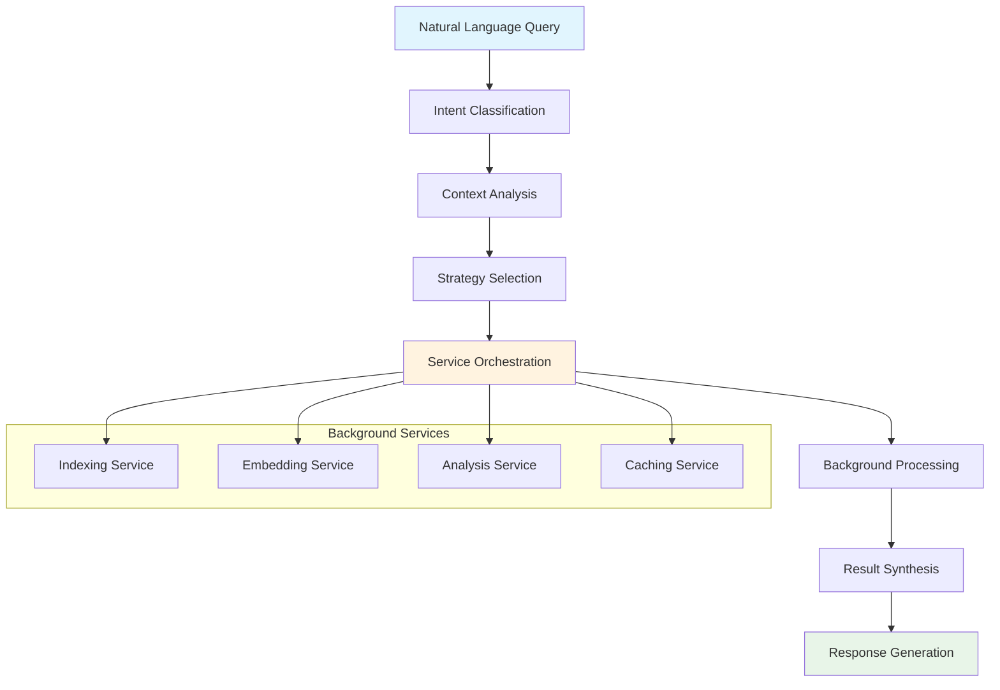

<!--
SPDX-FileCopyrightText: 2025 Knitli Inc.

SPDX-License-Identifier: MIT OR Apache-2.0
-->

# Intent-Based Codebase Interaction

!!! tip "Natural Language First"
    CodeWeaver's intent system lets you interact with codebases using natural language. No need to learn specific tool commands or parameters - just express what you want to accomplish.

CodeWeaver's revolutionary intent processing system transforms how you interact with codebases. Instead of manually orchestrating complex tool sequences, simply express your goals in natural language and let CodeWeaver handle the implementation details.

## Core Intent Types

CodeWeaver recognizes and processes three primary intent categories:

### 🔍 **Search Intent**
Find specific code, patterns, or functionality within your codebase.

**Example Patterns:**
```
Find all authentication functions
Search for React components that use useState
Show me error handling patterns
Locate database connection logic
```

**What happens behind the scenes:**
- Semantic embedding search across indexed code
- AST-based structural pattern matching when applicable  
- Intelligent result ranking and relevance scoring
- Context-aware filtering by file type, language, or framework

### 🧠 **Understand Intent**
Gain comprehensive understanding of systems, architectures, and code relationships.

**Example Patterns:**
```
Explain how the authentication system works
Help me understand the data flow from API to database
What is the overall architecture of this microservice?
How does the caching layer integrate with the application?
```

**What happens behind the scenes:**
- Multi-level code analysis combining semantic and structural understanding
- Cross-reference analysis to map dependencies and relationships
- Documentation synthesis from code comments, README files, and inline docs
- Architecture pattern recognition and explanation

### 📊 **Analyze Intent**
Perform deep analysis for code quality, performance, security, and patterns.

**Example Patterns:**
```
Analyze the performance bottlenecks in this API
What are the potential security vulnerabilities?
Review the testing coverage and strategies
Identify code duplication and refactoring opportunities
```

**What happens behind the scenes:**
- Static code analysis with pattern recognition
- Quality metrics calculation and trend analysis
- Security vulnerability scanning using known patterns
- Performance profiling based on algorithmic complexity

## Automatic Intent Classification

CodeWeaver uses advanced natural language processing to automatically classify your requests:

### **Intent Detection Algorithm**

1. **Keyword Analysis**: Identifies action words (find, explain, analyze, show, etc.)
2. **Context Recognition**: Understands subject matter (authentication, API, database, etc.)
3. **Complexity Assessment**: Determines scope (single function vs. system-wide analysis)
4. **Domain Classification**: Recognizes technical domains (security, performance, architecture)

### **Smart Fallbacks**

When intent classification is ambiguous, CodeWeaver:
- Combines multiple intent types for comprehensive results
- Provides clarifying questions to refine the request
- Offers suggestions for more specific queries
- Falls back to broad search when specific intent is unclear

## Advanced Intent Features

### **Multi-Path Analysis**
```
Compare the authentication implementations in the web and mobile APIs
```
Automatically processes multiple codebases or directories and provides comparative analysis.

### **Context-Aware Queries**
```
Find similar patterns to the user registration flow we just analyzed
```
Maintains conversation context to provide relevant, connected insights.

### **Temporal Analysis**
```
Show me how the error handling has evolved over the last 6 months
```
Leverages git history and code evolution tracking for temporal insights.

### **Cross-Language Understanding**
```
Find all API endpoints, whether they're in Python, Node.js, or Go
```
Unified search and analysis across different programming languages.

## Intent Query Best Practices

### **Be Specific About Scope**
✅ **Good:** "Find authentication middleware in the Express.js API server"
❌ **Vague:** "Find authentication stuff"

### **Provide Context When Helpful**
✅ **Good:** "Analyze SQL injection vulnerabilities in the user input handling"
❌ **Generic:** "Find security problems"

### **Use Domain-Specific Language**
✅ **Good:** "Show me React components with useEffect cleanup functions"
❌ **Unclear:** "Show me components that clean up"

### **Combine Intent Types Naturally**
✅ **Good:** "Find the payment processing code and explain how it handles errors"
❌ **Rigid:** "Search for payment AND analyze errors" (works, but less natural)

## Intent Processing Pipeline

When you submit an intent query, CodeWeaver follows this processing pipeline:



### **Pipeline Stages**

1. **Intent Classification** - Determines primary intent type and confidence
2. **Context Analysis** - Extracts entities, scope, and constraints
3. **Strategy Selection** - Chooses optimal processing approach
4. **Service Orchestration** - Coordinates background services and resources
5. **Background Processing** - Executes indexing, analysis, and computation
6. **Result Synthesis** - Combines results from multiple sources
7. **Response Generation** - Formats results for optimal comprehension

## Performance and Efficiency

### **Intelligent Caching**
- **Query-level caching**: Similar intent queries return cached results
- **Component-level caching**: Reuse analysis of individual files and functions
- **Context-aware invalidation**: Smart cache updates when code changes

### **Background Indexing**
- **On-demand indexing**: Index code automatically when first accessed
- **Incremental updates**: Only re-index changed files
- **Priority-based processing**: Focus on frequently queried code first

### **Resource Optimization**
- **Request batching**: Combine related operations for efficiency
- **Circuit breakers**: Prevent cascading failures in complex analysis
- **Load balancing**: Distribute processing across available resources

## Next Steps

<div class="grid cards" markdown>

-   :material-pattern: **[Intent Patterns](patterns.md)**

    Comprehensive library of intent query patterns and examples

-   :material-api: **[Intent API Reference](../api/mcp/process-intent.md)**

    Technical details of the intent processing API

-   :material-school: **[Intent Tutorials](../tutorials/intent-workflows.md)**

    Step-by-step tutorials for complex intent workflows

-   :material-cog: **[Configuration](../configuration/intent-config.md)**

    Customize intent processing behavior and performance

</div>

---

**Ready to master intent patterns?** → [Intent Patterns Guide](patterns.md)