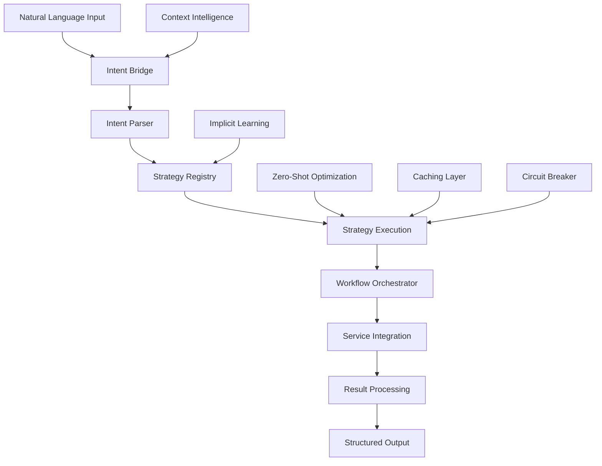

<!--
SPDX-FileCopyrightText: 2025 Knitli Inc.
SPDX-FileContributor: Adam Poulemanos <adam@knit.li>

SPDX-License-Identifier: MIT OR Apache-2.0
-->

# Intent Layer Architecture

This document provides a comprehensive technical reference for the Intent Layer architecture, designed for extension developers who need to understand the internal structure and extensibility points.

## System Overview



The Intent Layer implements a sophisticated pipeline architecture with multiple specialized components working together to transform natural language into precise, context-aware operations.

## Core Architecture Components

### Intent Processing Pipeline

#### 1. Intent Bridge (`intent/middleware/intent_bridge.py`)

The Intent Bridge connects the Intent Layer with FastMCP middleware, handling request/response transformation and service injection.

```python
class IntentServiceBridge(BaseServiceProvider):
    """Bridge between FastMCP middleware and Intent Layer services"""

    async def get_context_request(
        self,
        user_input: str,
        context: FastMCPContext
    ) -> IntentResult:
        """Main entry point for intent processing"""

        # Extract LLM context information
        llm_profile = await self.context_intelligence.extract_llm_profile(context)

        # Parse intent from natural language
        parsed_intent = await self.intent_parser.parse(user_input)

        # Select optimal strategy
        strategy = await self.strategy_registry.select_strategy(parsed_intent)

        # Assemble execution context
        execution_context = await self._assemble_context(context, llm_profile)

        # Execute with monitoring
        result = await self._execute_with_monitoring(
            strategy, parsed_intent, execution_context
        )

        # Cache result for future requests
        await self._cache_result(user_input, parsed_intent, result)

        return result
```

**Key Responsibilities**:
- FastMCP context extraction and transformation
- Service dependency injection
- Request/response lifecycle management
- Error handling and recovery coordination

#### 2. Intent Parser (`intent/parsing/`)

The parsing subsystem transforms natural language into structured intent representations.

```python
class PatternBasedParser(IntentParser):
    """Pattern-based intent parser using regex and confidence scoring"""

    def __init__(self, config: dict[str, Any]):
        self.patterns = self._load_patterns(config.get("patterns_file"))
        self.confidence_scorer = ConfidenceScorer(config.get("scoring", {}))

    async def parse(self, intent_text: str) -> ParsedIntent:
        """Parse natural language into structured intent"""

        # Extract intent type, target, and scope
        intent_matches = await self._match_patterns(intent_text)

        # Score confidence for each match
        scored_matches = await self.confidence_scorer.score_matches(
            intent_matches, intent_text
        )

        # Select best match
        best_match = self._select_best_match(scored_matches)

        # Build ParsedIntent
        return ParsedIntent(
            intent_type=best_match.intent_type,
            primary_target=best_match.target,
            scope=best_match.scope,
            complexity=self._assess_complexity(best_match, intent_text),
            confidence=best_match.confidence,
            filters=best_match.filters,
            metadata=best_match.metadata,
            parsed_at=datetime.now()
        )
```

**Extension Points**:
- Custom pattern definitions in configuration
- Pluggable confidence scoring algorithms
- Future NLP parser integration through factory pattern

#### 3. Strategy Registry (`intent/strategies/registry.py`)

The Strategy Registry manages strategy selection and performance optimization.

```python
class StrategyRegistry(BaseServiceProvider):
    """Registry for intent strategies with intelligent selection"""

    def __init__(self, extensibility_manager: ExtensibilityManager):
        self.extensibility_manager = extensibility_manager
        self.strategies: dict[str, IntentStrategy] = {}
        self.performance_tracker = PerformanceTracker()

    async def select_strategy(self, parsed_intent: ParsedIntent) -> IntentStrategy:
        """Select optimal strategy for parsed intent"""

        # Evaluate all strategies
        strategy_scores: dict[str, float] = {}

        for name, strategy in self.strategies.items():
            # Get capability score
            capability_score = await strategy.can_handle(parsed_intent)

            # Get performance history
            performance_score = await self.performance_tracker.get_performance_score(
                name, parsed_intent
            )

            # Combined scoring (70% capability, 30% performance)
            combined_score = (capability_score * 0.7) + (performance_score * 0.3)
            strategy_scores[name] = combined_score

        # Select highest scoring strategy
        best_strategy_name = max(strategy_scores, key=strategy_scores.get)
        return self.strategies[best_strategy_name]
```

**Key Features**:
- Dynamic strategy discovery through ExtensibilityManager
- Performance-based strategy optimization
- Comprehensive strategy metadata tracking
- Strategy health monitoring and circuit breaking

#### 4. Workflow Orchestrator (`intent/workflows/orchestrator.py`)

The Workflow Orchestrator manages multi-step operations and complex processing flows.

```python
class WorkflowOrchestrator(BaseServiceProvider):
    """Orchestrates multi-step workflows for complex intent processing"""

    async def execute_workflow(
        self,
        workflow: WorkflowDefinition,
        context: dict[str, Any]
    ) -> WorkflowResult:
        """Execute a multi-step workflow"""

        workflow_state = WorkflowState(workflow.name)

        try:
            # Validate workflow definition
            await self._validate_workflow(workflow)

            # Execute steps according to dependencies
            for step_batch in self._group_steps_by_dependencies(workflow.steps):
                if workflow.max_parallel_steps > 1:
                    # Parallel execution
                    step_results = await self._execute_steps_parallel(
                        step_batch, context, workflow_state
                    )
                else:
                    # Sequential execution
                    step_results = await self._execute_steps_sequential(
                        step_batch, context, workflow_state
                    )

                # Update workflow state
                workflow_state.add_step_results(step_results)

                # Check for early termination
                if not workflow.allow_partial_success and any(
                    not result.success for result in step_results.values()
                ):
                    break

            return self._build_workflow_result(workflow_state)

        except Exception as e:
            self.logger.exception("Workflow execution failed")
            return WorkflowResult(
                success=False,
                results={},
                error=str(e),
                partial_results=workflow_state.completed_steps
            )
```

**Capabilities**:
- Dependency-based step ordering
- Parallel and sequential execution modes
- Partial success handling
- Step timeout and retry mechanisms
- Comprehensive error recovery

## Service Integration Architecture

### Context Intelligence Service

```python
class ContextIntelligenceService(BaseServiceProvider):
    """Analyzes LLM context and adapts intent processing accordingly"""

    async def extract_llm_profile(self, context: FastMCPContext) -> LLMProfile:
        """Extract LLM behavioral profile from request context"""

        # Analyze request characteristics
        request_features = await self._extract_request_features(context)

        # Model identification through behavioral fingerprinting
        identified_model, confidence = await self.model_detector.identify_model(
            request_features
        )

        # Session tracking (privacy-aware)
        session_id = self._get_or_create_session_id(context)

        return LLMProfile(
            session_id=session_id,
            identified_model=identified_model,
            confidence=confidence,
            behavioral_features=request_features,
            context_preferences=self._get_model_preferences(identified_model),
            created_at=datetime.now()
        )

    async def adapt_context_for_llm(
        self,
        result: IntentResult,
        llm_profile: LLMProfile
    ) -> IntentResult:
        """Adapt result presentation for specific LLM characteristics"""

        # Get LLM-specific preferences
        preferences = llm_profile.context_preferences

        # Adapt result format
        if preferences.format_preference == "structured":
            result.data = self._structure_data(result.data)
        elif preferences.format_preference == "conversational":
            result.data = self._conversationalize_data(result.data)

        # Adjust detail level
        if preferences.context_preference == "concise":
            result = self._condense_result(result)
        elif preferences.context_preference == "detailed":
            result = self._expand_result(result)

        return result
```

### Implicit Learning Service

```python
class ImplicitLearningService(BaseServiceProvider):
    """Learns from usage patterns to optimize intent processing"""

    def __init__(self, config: ImplicitLearningServiceConfig):
        super().__init__(config)
        self.pattern_store = PatternStore(config.storage)
        self.learning_engine = LearningEngine(config.learning)

    async def record_interaction(
        self,
        parsed_intent: ParsedIntent,
        result: IntentResult,
        llm_profile: LLMProfile
    ) -> None:
        """Record interaction for pattern learning"""

        if not self.config.learning_enabled:
            return

        # Create interaction record
        interaction = InteractionRecord(
            intent_signature=self._create_intent_signature(parsed_intent),
            llm_model=llm_profile.identified_model,
            success=result.success,
            execution_time=result.execution_time,
            confidence=parsed_intent.confidence,
            strategy_used=result.strategy_used,
            timestamp=datetime.now()
        )

        # Store interaction (anonymized)
        if self.config.anonymize_patterns:
            interaction = self._anonymize_interaction(interaction)

        await self.pattern_store.store_interaction(interaction)

        # Update learned patterns
        await self.learning_engine.update_patterns(interaction)

    async def get_optimization_suggestions(
        self,
        parsed_intent: ParsedIntent
    ) -> list[OptimizationSuggestion]:
        """Get optimization suggestions based on learned patterns"""

        intent_signature = self._create_intent_signature(parsed_intent)

        # Query learned patterns
        patterns = await self.pattern_store.get_patterns_for_signature(intent_signature)

        # Generate suggestions
        suggestions = []
        for pattern in patterns:
            if pattern.success_rate > self.config.pattern_confidence_threshold:
                suggestions.append(
                    OptimizationSuggestion(
                        strategy_name=pattern.optimal_strategy,
                        confidence=pattern.success_rate,
                        estimated_time=pattern.avg_execution_time,
                        reasoning=pattern.optimization_rationale
                    )
                )

        return suggestions
```

### Zero-Shot Optimization Service

```python
class ZeroShotOptimizationService(BaseServiceProvider):
    """Predicts optimal strategies without historical data"""

    async def predict_optimal_strategy(
        self,
        parsed_intent: ParsedIntent,
        available_strategies: list[IntentStrategy]
    ) -> StrategyPrediction:
        """Predict optimal strategy using zero-shot analysis"""

        # Analyze intent characteristics
        intent_features = self._extract_intent_features(parsed_intent)

        # Analyze strategy capabilities
        strategy_capabilities = {}
        for strategy in available_strategies:
            capabilities = await self._analyze_strategy_capabilities(
                strategy, intent_features
            )
            strategy_capabilities[strategy.__class__.__name__] = capabilities

        # Predict optimal match
        prediction = await self.prediction_engine.predict_optimal_match(
            intent_features, strategy_capabilities
        )

        return StrategyPrediction(
            recommended_strategy=prediction.strategy_name,
            confidence=prediction.confidence,
            estimated_performance=prediction.performance_estimate,
            reasoning=prediction.reasoning_chain
        )
```

## Extensibility Architecture

### Plugin Discovery and Registration

```python
class PluginDiscoveryEngine:
    """Discovers and registers intent layer plugins"""

    async def discover_intent_strategies(self) -> list[ComponentInfo]:
        """Discover intent strategy plugins"""

        strategies = []

        # Entry point discovery
        for entry_point in pkg_resources.iter_entry_points("codeweaver.intent_strategies"):
            strategy_class = entry_point.load()
            strategies.append(self._create_component_info(strategy_class, entry_point))

        # Directory scanning
        plugin_dirs = self.config.get("plugin_directories", [])
        for plugin_dir in plugin_dirs:
            directory_strategies = await self._scan_directory_for_strategies(plugin_dir)
            strategies.extend(directory_strategies)

        return strategies

    async def register_strategy(
        self,
        strategy_class: type[IntentStrategy],
        metadata: dict[str, Any]
    ) -> None:
        """Register a strategy with the intent layer"""

        # Validate strategy implementation
        await self._validate_strategy_interface(strategy_class)

        # Create and initialize strategy instance
        strategy_instance = strategy_class(metadata.get("config", {}))
        await strategy_instance.initialize()

        # Register with strategy registry
        await self.strategy_registry.register_strategy(
            metadata["name"], strategy_instance, metadata
        )

        self.logger.info(
            "Registered intent strategy: %s",
            metadata["name"]
        )
```

### Protocol-Based Extension

```python
@runtime_checkable
class IntentStrategy(Protocol):
    """Protocol defining intent strategy interface"""

    async def can_handle(self, parsed_intent: ParsedIntent) -> float:
        """Return confidence score (0.0-1.0) for handling this intent"""
        ...

    async def execute(
        self,
        parsed_intent: ParsedIntent,
        context: dict[str, Any]
    ) -> IntentResult:
        """Execute the intent and return structured results"""
        ...

    # Optional lifecycle methods
    async def initialize(self) -> None:
        """Initialize strategy resources"""
        ...

    async def cleanup(self) -> None:
        """Clean up strategy resources"""
        ...

    async def health_check(self) -> ServiceHealth:
        """Check strategy health status"""
        ...

@runtime_checkable
class IntentParser(Protocol):
    """Protocol defining intent parser interface"""

    async def parse(self, intent_text: str) -> ParsedIntent:
        """Parse natural language input into structured intent"""
        ...

    async def validate_intent(self, parsed_intent: ParsedIntent) -> bool:
        """Validate parsed intent structure"""
        ...
```

## Performance Architecture

### Caching Strategy

```python
class IntentCacheService(BaseServiceProvider):
    """High-performance caching for intent processing results"""

    def __init__(self, config: dict[str, Any]):
        super().__init__(config)
        self.cache_backend = self._create_cache_backend(config)
        self.cache_key_generator = CacheKeyGenerator(config.get("key_generation", {}))

    async def get_cached_result(
        self,
        user_input: str,
        parsed_intent: ParsedIntent | None = None
    ) -> IntentResult | None:
        """Retrieve cached result if available"""

        # Generate cache key
        cache_key = await self.cache_key_generator.generate_key(
            user_input, parsed_intent
        )

        # Check cache
        cached_data = await self.cache_backend.get(cache_key)
        if cached_data:
            # Deserialize and validate
            try:
                result = IntentResult.from_dict(cached_data)
                if self._is_cache_valid(result):
                    return result
            except Exception as e:
                self.logger.warning("Invalid cached data: %s", e)
                await self.cache_backend.delete(cache_key)

        return None

    async def cache_result(
        self,
        user_input: str,
        parsed_intent: ParsedIntent,
        result: IntentResult
    ) -> None:
        """Cache intent processing result"""

        if not self._should_cache(result):
            return

        cache_key = await self.cache_key_generator.generate_key(
            user_input, parsed_intent
        )

        # Serialize result
        cached_data = result.to_dict()

        # Set TTL based on result characteristics
        ttl = self._calculate_ttl(result, parsed_intent)

        await self.cache_backend.set(cache_key, cached_data, ttl=ttl)
```

### Circuit Breaker Implementation

```python
class IntentCircuitBreaker:
    """Circuit breaker for intent strategy execution"""

    def __init__(self, config: dict[str, Any]):
        self.failure_threshold = config.get("failure_threshold", 5)
        self.success_threshold = config.get("success_threshold", 3)
        self.timeout = config.get("timeout", 60.0)
        self.recovery_timeout = config.get("recovery_timeout", 300.0)

        self.state = CircuitBreakerState.CLOSED
        self.failure_count = 0
        self.success_count = 0
        self.last_failure_time: datetime | None = None

    async def call(
        self,
        strategy: IntentStrategy,
        parsed_intent: ParsedIntent,
        context: dict[str, Any]
    ) -> IntentResult:
        """Execute strategy through circuit breaker"""

        # Check circuit state
        if self.state == CircuitBreakerState.OPEN:
            if self._should_attempt_reset():
                self.state = CircuitBreakerState.HALF_OPEN
                self.success_count = 0
            else:
                raise CircuitBreakerOpenError("Circuit breaker is open")

        try:
            # Execute strategy
            result = await asyncio.wait_for(
                strategy.execute(parsed_intent, context),
                timeout=self.timeout
            )

            # Record success
            await self._record_success(result)

            return result

        except Exception as e:
            # Record failure
            await self._record_failure(e)
            raise

    async def _record_success(self, result: IntentResult) -> None:
        """Record successful execution"""
        if self.state == CircuitBreakerState.HALF_OPEN:
            self.success_count += 1
            if self.success_count >= self.success_threshold:
                self.state = CircuitBreakerState.CLOSED
                self.failure_count = 0
        elif self.state == CircuitBreakerState.CLOSED:
            self.failure_count = max(0, self.failure_count - 1)

    async def _record_failure(self, error: Exception) -> None:
        """Record failed execution"""
        self.failure_count += 1
        self.last_failure_time = datetime.now()

        if self.failure_count >= self.failure_threshold:
            self.state = CircuitBreakerState.OPEN
```

## Data Structures and Types

### Core Data Types

```python
@dataclass
class ParsedIntent:
    """Structured representation of parsed user intent"""
    intent_type: IntentType          # SEARCH, UNDERSTAND, ANALYZE
    primary_target: str              # Main focus of the intent
    scope: Scope                     # FILE, MODULE, PROJECT, SYSTEM
    complexity: Complexity           # SIMPLE, MODERATE, COMPLEX, ADAPTIVE
    confidence: float                # Parser confidence (0.0-1.0)
    filters: dict[str, Any]          # Additional constraints and filters
    metadata: dict[str, Any]         # Processing metadata
    parsed_at: datetime              # When intent was parsed

@dataclass
class IntentResult:
    """Structured result from intent processing"""
    success: bool                    # Processing success flag
    data: Any                        # Main result data
    metadata: dict[str, Any]         # Execution metadata
    executed_at: datetime            # Execution timestamp
    execution_time: float            # Duration in seconds
    error_message: str | None        # Error details if failed
    suggestions: list[str] | None    # Suggested next actions
    strategy_used: str | None        # Strategy that handled intent

@dataclass
class LLMProfile:
    """Profile of LLM behavioral characteristics"""
    session_id: str                  # Session identifier (hashed)
    identified_model: str | None     # Detected LLM model
    confidence: float                # Identification confidence
    behavioral_features: dict[str, Any]  # Behavioral fingerprint
    context_preferences: ContextPreferences  # Format preferences
    created_at: datetime             # Profile creation time

class ContextPreferences(TypedDict):
    """LLM context and format preferences"""
    context_preference: Literal["concise", "detailed", "balanced"]
    format_preference: Literal["structured", "conversational", "hierarchical"]
    complexity_handling: Literal["adaptive", "simplified", "comprehensive"]
```

### Configuration Types

```python
class IntentServiceConfig(ServiceConfig):
    """Configuration for intent orchestration service"""
    provider: str = "intent_orchestrator"
    default_strategy: str = "adaptive"
    confidence_threshold: float = 0.6
    max_execution_time: float = 30.0
    cache_ttl: int = 3600

    # Parser configuration
    use_nlp_fallback: bool = False
    pattern_matching: bool = True
    custom_patterns_file: str | None = None

    # Performance configuration
    circuit_breaker_enabled: bool = True
    circuit_breaker_threshold: int = 5
    circuit_breaker_reset_time: float = 60.0
    max_concurrent_intents: int = 10

    class Config:
        extra = "allow"  # Allow additional configuration
```

## Integration Points

### FastMCP Integration

The Intent Layer integrates seamlessly with FastMCP middleware through the Intent Bridge:

```python
# Service registration with FastMCP
async def setup_intent_layer(app: FastMCPApplication):
    """Setup intent layer with FastMCP application"""

    # Register intent service
    intent_service = IntentOrchestratorService(app.config.services.intent)
    await app.register_service("intent", intent_service)

    # Register intent bridge middleware
    intent_bridge = IntentServiceBridge(intent_service)
    app.add_middleware(IntentBridgeMiddleware(intent_bridge))

    # Register MCP tools that use intent layer
    @app.tool("natural_language_search")
    async def natural_language_search(
        query: str,
        ctx: FastMCPContext
    ) -> dict[str, Any]:
        """Natural language code search using intent layer"""
        intent_service = ctx.get_service("intent")
        result = await intent_service.get_context(query, ctx)
        return result.to_dict()
```

### Extension Development Integration

```python
# Plugin entry point configuration
# setup.py or pyproject.toml
entry_points = {
    "codeweaver.intent_strategies": [
        "security_analysis = myorg.strategies:SecurityAnalysisStrategy",
        "performance_analysis = myorg.strategies:PerformanceAnalysisStrategy",
    ],
    "codeweaver.intent_parsers": [
        "nlp_parser = myorg.parsers:NLPEnhancedParser",
    ]
}
```

## Future Architecture Considerations

### NLP Integration Architecture

```python
class HybridIntentParser(IntentParser):
    """Future hybrid parser combining patterns with NLP"""

    def __init__(self, config: dict[str, Any]):
        # Pattern-based parser (current)
        self.pattern_parser = PatternBasedParser(config.get("patterns", {}))

        # NLP parser (future)
        if config.get("nlp_enabled", False):
            self.nlp_parser = NLPEnhancedParser(config.get("nlp", {}))
        else:
            self.nlp_parser = None

    async def parse(self, intent_text: str) -> ParsedIntent:
        """Parse using hybrid approach"""

        # Always try pattern-based parsing
        pattern_result = await self.pattern_parser.parse(intent_text)

        # Try NLP if available and pattern confidence is low
        if (self.nlp_parser and
            pattern_result.confidence < self.config.get("nlp_fallback_threshold", 0.6)):

            nlp_result = await self.nlp_parser.parse(intent_text)

            # Use best result
            if nlp_result.confidence > pattern_result.confidence:
                return nlp_result

        return pattern_result
```

### Distributed Processing Architecture

```python
class DistributedIntentProcessor:
    """Future distributed intent processing capability"""

    async def process_complex_intent(
        self,
        parsed_intent: ParsedIntent,
        context: dict[str, Any]
    ) -> IntentResult:
        """Process complex intents across multiple workers"""

        # Determine if distribution is needed
        if parsed_intent.complexity != Complexity.COMPLEX:
            return await self._process_locally(parsed_intent, context)

        # Split into sub-intents
        sub_intents = await self._decompose_intent(parsed_intent)

        # Distribute processing
        sub_results = await asyncio.gather(*[
            self._process_sub_intent(sub_intent, context)
            for sub_intent in sub_intents
        ])

        # Combine results
        return await self._combine_results(sub_results, parsed_intent)
```

## Next Steps

1. **[API Reference](api-reference.md)**: Detailed interface documentation
2. **[Custom Strategies](custom-strategies.md)**: Building custom intent handlers
3. **[Configuration](configuration.md)**: Advanced configuration options
4. **[Examples](examples.md)**: Practical implementation examples
