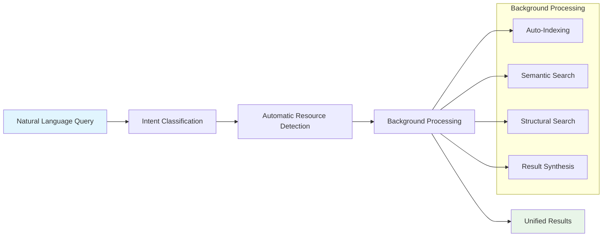

<!--
SPDX-FileCopyrightText: 2025 Knitli Inc.

SPDX-License-Identifier: MIT OR Apache-2.0
-->

# Migration Guide: Traditional Tools to Intent Interface

!!! tip "Seamless Transition"
    This guide helps you transition from traditional MCP tool usage to CodeWeaver's revolutionary intent-based interface. The migration is designed to be gradual and non-breaking.

CodeWeaver has evolved from a traditional multi-tool MCP server to a sophisticated intent processing system. This guide provides a comprehensive migration path from explicit tool usage to natural language intent processing.

## Migration Overview

### **What's Changing**

The fundamental interaction model has evolved:

=== "Traditional Approach (Old)"
    ```python
    # Explicit tool orchestration required
    1. call index_codebase("/path/to/project")
    2. call search_code("authentication functions")
    3. call ast_grep_search("class $_ extends BaseAuth", "typescript")
    4. call get_supported_languages()
    ```

=== "Intent-Based Approach (New)"
    ```python
    # Single natural language query
    1. "Find all authentication functions in /path/to/project"
    # CodeWeaver automatically handles indexing, search, and result synthesis
    ```

### **Compatibility Status**

| Tool | Status | Migration Path |
|------|--------|---------------|
| `process_intent` | ✅ **Active** | Primary interface - no migration needed |
| `get_intent_capabilities` | ✅ **Active** | Enhanced capabilities - update usage |
| `index_codebase` | ⚠️ **Legacy** | Automatic background indexing replaces manual calls |
| `search_code` | ⚠️ **Legacy** | Intent queries replace explicit search calls |
| `ast_grep_search` | ⚠️ **Legacy** | Structural patterns integrated into intent processing |
| `get_supported_languages` | ⚠️ **Legacy** | Language info available via intent capabilities |

!!! warning "Legacy Tool Status"
    Legacy tools are currently disabled but remain in the codebase for potential backward compatibility. The intent interface provides all functionality with enhanced capabilities.

## Step-by-Step Migration

### **Phase 1: Understanding Intent Processing**

Before migrating, understand how intent processing works:



#### **Intent Classification**

CodeWeaver automatically classifies your natural language into intent types:

- **Search Intent**: Finding specific code, patterns, or functionality
- **Understand Intent**: Gaining comprehension of systems and architecture
- **Analyze Intent**: Deep analysis for quality, security, and performance

### **Phase 2: Converting Tool Calls to Intent Queries**

#### **Indexing Migration**

=== "Traditional Tool Usage"
    ```python
    # Manual indexing workflow
    result = await mcp_client.call_tool("index_codebase", {
        "path": "/path/to/project",
        "file_filter": "*.py,*.js,*.ts",
        "language_filter": "python,javascript,typescript"
    })
    
    if result["status"] == "success":
        print(f"Indexed {result['files_processed']} files")
    ```

=== "Intent-Based Equivalent"
    ```python
    # Automatic background indexing
    result = await mcp_client.call_tool("process_intent", {
        "intent": "Index and prepare the Python, JavaScript, and TypeScript code in /path/to/project for analysis"
    })
    
    # Or even simpler - indexing happens automatically:
    result = await mcp_client.call_tool("process_intent", {
        "intent": "Find all authentication functions in /path/to/project"
    })
    # CodeWeaver automatically discovers, indexes, and searches the codebase
    ```

#### **Search Migration**

=== "Traditional Tool Usage"
    ```python
    # Multi-step search workflow
    search_result = await mcp_client.call_tool("search_code", {
        "query": "authentication middleware",
        "limit": 10,
        "file_filter": "*.js,*.ts",
        "language_filter": "javascript,typescript",
        "rerank": True
    })
    
    # Follow up with structural search
    pattern_result = await mcp_client.call_tool("ast_grep_search", {
        "pattern": "function $_(req, res, next) { $$$ }",
        "language": "javascript",
        "root_path": "/path/to/project",
        "limit": 20
    })
    ```

=== "Intent-Based Equivalent"
    ```python
    # Single natural language query
    result = await mcp_client.call_tool("process_intent", {
        "intent": "Find all authentication middleware functions in the JavaScript and TypeScript code"
    })
    
    # Or with more specific structural requirements:
    result = await mcp_client.call_tool("process_intent", {
        "intent": "Find all Express.js middleware functions that follow the pattern function(req, res, next) in /path/to/project"
    })
    ```

#### **Language Support Migration**

=== "Traditional Tool Usage"
    ```python
    # Check language capabilities
    languages = await mcp_client.call_tool("get_supported_languages")
    
    # Filter by supported languages
    if "python" in languages["supported"]:
        # Proceed with Python-specific operations
        pass
    ```

=== "Intent-Based Equivalent"
    ```python
    # Query capabilities naturally
    capabilities = await mcp_client.call_tool("get_intent_capabilities")
    
    # Or ask directly in natural language:
    result = await mcp_client.call_tool("process_intent", {
        "intent": "What programming languages and file types can you analyze?"
    })
    ```

### **Phase 3: Leveraging Enhanced Intent Capabilities**

#### **Complex Query Migration**

Traditional approaches required multiple tool calls for complex analysis:

=== "Traditional Multi-Tool Workflow"
    ```python
    # Step 1: Index the codebase
    index_result = await mcp_client.call_tool("index_codebase", {
        "path": "/path/to/project"
    })
    
    # Step 2: Search for authentication code
    auth_search = await mcp_client.call_tool("search_code", {
        "query": "authentication security",
        "limit": 20
    })
    
    # Step 3: Find structural patterns
    auth_patterns = await mcp_client.call_tool("ast_grep_search", {
        "pattern": "class $_ extends $$$Auth",
        "language": "typescript",
        "root_path": "/path/to/project"
    })
    
    # Step 4: Manual analysis and synthesis
    # Developer needs to combine results manually
    ```

=== "Intent-Based Single Query"
    ```python
    # Single comprehensive query
    result = await mcp_client.call_tool("process_intent", {
        "intent": "Analyze the authentication and security implementation in /path/to/project, including both semantic patterns and structural inheritance from Auth base classes"
    })
    
    # CodeWeaver automatically:
    # - Indexes the codebase in background
    # - Performs semantic search for authentication/security
    # - Identifies structural patterns like class inheritance
    # - Synthesizes comprehensive analysis
    # - Returns unified, structured results
    ```

#### **Advanced Intent Patterns**

Leverage the full power of intent processing:

```python
# Multi-domain analysis
result = await mcp_client.call_tool("process_intent", {
    "intent": "Find all security vulnerabilities in the authentication system and analyze their impact on the overall application architecture"
})

# Comparative analysis
result = await mcp_client.call_tool("process_intent", {
    "intent": "Compare the error handling patterns between the REST API and GraphQL API implementations"
})

# Temporal analysis
result = await mcp_client.call_tool("process_intent", {
    "intent": "Show me how the database connection management has evolved over the last 6 months"
})

# Cross-language analysis
result = await mcp_client.call_tool("process_intent", {
    "intent": "Find all API endpoints across Python, Node.js, and Go services that handle user data"
})
```

## Migration Checklist

### **Pre-Migration Assessment**

- [ ] **Inventory Current Usage**: List all `index_codebase`, `search_code`, `ast_grep_search` calls
- [ ] **Identify Workflow Patterns**: Document multi-step tool orchestration workflows
- [ ] **Analyze Query Complexity**: Categorize simple vs. complex analysis requirements
- [ ] **Review Integration Points**: Check how tool results are consumed by downstream systems

### **Migration Execution**

- [ ] **Update Client Code**: Replace tool calls with intent queries
- [ ] **Test Intent Queries**: Verify intent processing produces equivalent results
- [ ] **Update Error Handling**: Adapt error handling for intent processing responses
- [ ] **Performance Testing**: Compare performance between old and new approaches
- [ ] **Documentation Updates**: Update internal documentation with intent patterns

### **Post-Migration Validation**

- [ ] **Functionality Verification**: Ensure all use cases work with intent interface
- [ ] **Performance Validation**: Confirm acceptable performance characteristics
- [ ] **Result Quality**: Verify intent processing provides equivalent or better results
- [ ] **User Experience**: Confirm improved usability with natural language interface

## Common Migration Patterns

### **Pattern 1: Simple Search Replacement**

```python
# Before: Traditional search
search_result = await search_code("React hooks", limit=10)

# After: Intent-based search
result = await process_intent("Find all React hooks in the codebase")
```

### **Pattern 2: Complex Analysis Workflow**

```python
# Before: Multi-step traditional workflow
def analyze_authentication():
    # Step 1: Index
    index_result = index_codebase("/src/auth")
    
    # Step 2: Search
    search_results = search_code("authentication middleware")
    
    # Step 3: Pattern matching
    patterns = ast_grep_search("class $_ extends Auth", "typescript")
    
    # Step 4: Manual synthesis
    return synthesize_results(search_results, patterns)

# After: Single intent query
result = await process_intent(
    "Analyze the authentication middleware implementation, including class inheritance patterns and security mechanisms"
)
```

### **Pattern 3: Multi-Language Analysis**

```python
# Before: Language-specific tool calls
python_results = search_code("API endpoints", language_filter="python")
js_results = search_code("API endpoints", language_filter="javascript")
ts_results = search_code("API endpoints", language_filter="typescript")

# After: Unified intent query
result = await process_intent(
    "Find all API endpoints across Python, JavaScript, and TypeScript code"
)
```

## Troubleshooting Migration Issues

### **Common Issues and Solutions**

#### **Issue: Intent Not Understood**

```python
# Problem: Vague intent
result = await process_intent("Find code")

# Solution: Be specific about what you're looking for
result = await process_intent("Find all authentication functions in the user management module")
```

#### **Issue: Inconsistent Results**

```python
# Problem: Context missing
result = await process_intent("Find the login function")

# Solution: Provide context and constraints
result = await process_intent("Find the login function in the authentication service, specifically the main authentication endpoint")
```

#### **Issue: Performance Concerns**

```python
# Problem: Very broad query
result = await process_intent("Analyze everything in the codebase")

# Solution: Scope your analysis
result = await process_intent("Analyze the authentication and authorization patterns in the backend API services")
```

### **Performance Optimization**

#### **Background Indexing Optimization**

```python
# Trigger background indexing for large codebases
result = await process_intent(
    "Prepare the entire monorepo for analysis, focusing on TypeScript and Python services"
)

# Subsequent queries will be faster due to pre-indexing
result = await process_intent("Find all database connection patterns")
```

#### **Caching Benefits**

The intent system provides automatic caching:

- **Query-level caching**: Similar intent queries return cached results
- **Component-level caching**: File analysis is cached and reused
- **Context-aware invalidation**: Cache updates when code changes are detected

## Advanced Migration Techniques

### **Gradual Migration Strategy**

For large codebases and teams, consider a gradual migration:

```python
class CodebaseAnalyzer:
    def __init__(self, use_intent_processing: bool = False):
        self.use_intent_processing = use_intent_processing
    
    async def find_functions(self, query: str, path: str):
        if self.use_intent_processing:
            # New intent-based approach
            return await process_intent(f"Find {query} functions in {path}")
        else:
            # Legacy tool-based approach
            await index_codebase(path)
            return await search_code(query)

# Enable intent processing gradually
analyzer = CodebaseAnalyzer(use_intent_processing=True)
```

### **Result Format Adaptation**

Adapt your result processing to handle intent response format:

```python
def process_search_results(result):
    if 'intent_result' in result:
        # Intent processing result format
        return {
            'matches': result['intent_result']['matches'],
            'summary': result['intent_result']['summary'],
            'confidence': result['intent_result']['confidence']
        }
    else:
        # Legacy tool result format
        return {
            'matches': result['results'],
            'summary': None,
            'confidence': 1.0
        }
```

## Migration Success Metrics

Track these metrics to measure migration success:

### **Functional Metrics**
- **Query Success Rate**: Percentage of intent queries that return useful results
- **Result Relevance**: Quality and relevance of intent processing results
- **Coverage Completeness**: Ability to handle all previous use cases with intents

### **Performance Metrics**
- **Query Response Time**: Time from intent submission to result delivery
- **Background Indexing Time**: Time for initial codebase indexing
- **Cache Hit Rate**: Percentage of queries served from cache

### **User Experience Metrics**
- **Query Simplification**: Reduction in query complexity and multi-step workflows
- **Learning Curve**: Time for users to adopt intent-based queries effectively
- **User Satisfaction**: Subjective experience improvement with natural language interface

## Next Steps

<div class="grid cards" markdown>

-   :material-brain: **[Intent Pattern Library](../intent-guide/patterns.md)**

    Master natural language patterns for all use cases

-   :material-api: **[Process Intent API](../api/mcp/process-intent.md)**

    Complete API reference for intent processing

-   :material-school: **[Intent Tutorials](../tutorials/intent-workflows/codebase-exploration.md)**

    Step-by-step tutorials for intent-based workflows

-   :material-help-circle: **[Community Support](../community/support.md)**

    Get help with your migration and share experiences

</div>

---

**Need help with migration?** → [Community Support](../community/support.md)

**Ready to explore intent patterns?** → [Intent Pattern Library](../intent-guide/patterns.md)