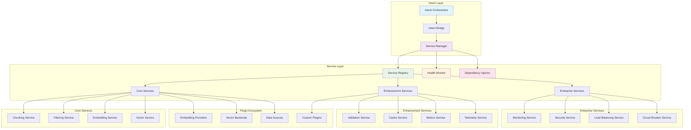

<!--
SPDX-FileCopyrightText: 2025 Knitli Inc.

SPDX-License-Identifier: MIT OR Apache-2.0
-->

# Service Layer

CodeWeaver's service layer provides the core processing capabilities for semantic code search. It coordinates chunking, filtering, embedding, and search operations through a plugin architecture.

## Core Services

CodeWeaver's service layer coordinates several key services for code analysis:

### Chunking Service
Intelligent code segmentation using AST parsing with fallback strategies:
- **AST-aware parsing** for 20+ programming languages
- **Semantic boundaries** that respect code structure
- **Fallback parsing** when AST parsing isn't available
- **Configurable chunk sizes** optimized for embedding models

### Filtering Service  
File discovery and filtering with gitignore support:
- **Gitignore compliance** - respects project ignore patterns
- **Language detection** and file type filtering
- **Size limits** to skip large binary or generated files
- **Custom patterns** for project-specific filtering

### Embedding Service
Vector embedding generation with provider abstraction:
- **Multiple providers**: Voyage AI, OpenAI, Cohere, HuggingFace
- **Batch processing** for efficiency
- **Configurable models** optimized for code
- **Provider fallback** for reliability

### Vector Service
Vector storage and retrieval with backend abstraction:
- **Multiple backends**: Qdrant, Pinecone, Weaviate, ChromaDB
- **Collection management** with automatic setup
- **Similarity search** with configurable parameters
- **Metadata filtering** for targeted results

## Optional Services

### Validation Service
Content validation with configurable rules:
- **File format validation**
- **Content quality checks**
- **Security scanning**
- **Custom validation rules**

### Cache Service
Multi-level caching for performance:
- **Vector cache** for embedding results
- **Query cache** for search results
- **File metadata cache** for filtering
- **Intelligent invalidation**

## Service Architecture Diagram



## Service Provider Architecture

### **Provider Registration System**

Services are registered through a sophisticated provider system that enables:

```python
# Service registration example
from codeweaver.services.providers.base_provider import BaseServiceProvider
from codeweaver.cw_types import ChunkingService, ServiceType

class CustomChunkingProvider(BaseServiceProvider, ChunkingService):
    async def _initialize_provider(self) -> None:
        # Custom initialization logic
        self._ast_parser = await self._create_ast_parser()
        self._fallback_parser = await self._create_fallback_parser()

    async def chunk_content(self, content: str, file_path: str) -> list[ContentChunk]:
        # Custom chunking implementation
        try:
            return await self._ast_parser.chunk(content, file_path)
        except Exception:
            return await self._fallback_parser.chunk(content, file_path)

# Register with the service factory
factory.register_service_provider(
    ServiceType.CHUNKING,
    "custom_chunking",
    CustomChunkingProvider
)
```

### **Dependency Injection Pattern**

The service layer implements comprehensive dependency injection:

```python
# Service dependency injection
@dataclass
class ServiceContext:
    chunking_service: ChunkingService
    filtering_service: FilteringService
    validation_service: ValidationService | None = None
    cache_service: CacheService | None = None

# Automatic service resolution
async def process_codebase(path: str, context: ServiceContext) -> ProcessingResult:
    # Services are automatically injected and validated
    files = await context.filtering_service.discover_files(path)
    
    for file_path in files:
        content = await read_file(file_path)
        chunks = await context.chunking_service.chunk_content(content, file_path)
        
        if context.validation_service:
            chunks = await context.validation_service.validate_chunks(chunks)
```

## Service Configuration Management

### **Hierarchical Configuration System**

Services are configured through a hierarchical system that supports:

```yaml
# Service configuration example
services:
  chunking:
    provider: "fastmcp_chunking"
    config:
      max_chunk_size: 1500
      min_chunk_size: 50
      ast_grep_enabled: true
      performance_mode: "balanced"
      fallback_strategy: "regex_parsing"
  
  filtering:
    provider: "fastmcp_filtering"
    config:
      use_gitignore: true
      max_file_size: 1048576
      parallel_scanning: true
      custom_patterns:
        - "*.generated.*"
        - "vendor/**"
  
  validation:
    provider: "fastmcp_validation"
    config:
      enabled: true
      validation_rules:
        - "no_empty_chunks"
        - "valid_utf8_encoding"
        - "reasonable_chunk_size"
```

### **Environment Variable Support**

All service configurations can be overridden via environment variables:

```bash
# Override chunking service configuration
CW_CHUNKING_MAX_CHUNK_SIZE=2000
CW_CHUNKING_PERFORMANCE_MODE=aggressive

# Override filtering service configuration
CW_FILTERING_USE_GITIGNORE=false
CW_FILTERING_MAX_FILE_SIZE=2097152

# Enable enterprise services
CW_MONITORING_ENABLED=true
CW_CIRCUIT_BREAKER_ENABLED=true
```

## Service Health Monitoring

### **Comprehensive Health Checks**

Each service implements standardized health monitoring:

```python
@dataclass
class ServiceHealth:
    status: HealthStatus  # HEALTHY, DEGRADED, UNHEALTHY, UNKNOWN
    last_check: datetime
    response_time: float
    error_count: int
    success_rate: float
    metadata: dict[str, Any]

# Health check implementation
class ChunkingServiceProvider(BaseServiceProvider, ChunkingService):
    async def health_check(self) -> ServiceHealth:
        start_time = time.time()
        try:
            # Perform health check operation
            test_result = await self._test_chunking_operation()
            response_time = time.time() - start_time
            
            return ServiceHealth(
                status=HealthStatus.HEALTHY,
                last_check=datetime.now(),
                response_time=response_time,
                error_count=self._error_count,
                success_rate=self._calculate_success_rate(),
                metadata={
                    "ast_parser_available": self._ast_parser.is_available(),
                    "processed_files_today": self._daily_file_count,
                    "cache_hit_rate": self._cache_hit_rate
                }
            )
        except Exception as e:
            return ServiceHealth(
                status=HealthStatus.UNHEALTHY,
                last_check=datetime.now(),
                response_time=time.time() - start_time,
                error_count=self._error_count + 1,
                success_rate=self._calculate_success_rate(),
                metadata={"error": str(e)}
            )
```

### **Auto-Recovery Mechanisms**

Services implement intelligent auto-recovery:

```python
class ServiceAutoRecovery:
    async def handle_service_failure(self, service: ServiceProvider, error: Exception):
        if isinstance(error, TemporaryFailure):
            # Retry with exponential backoff
            await self._retry_with_backoff(service)
        elif isinstance(error, ConfigurationError):
            # Reload configuration and restart service
            await self._reload_and_restart(service)
        elif isinstance(error, ResourceExhaustion):
            # Scale resources or activate circuit breaker
            await self._handle_resource_exhaustion(service)
        else:
            # Failover to backup service or degrade gracefully
            await self._failover_or_degrade(service)
```

## Performance and Scalability

### **Resource Management**

The service layer implements sophisticated resource management:

- **Memory Management**: Automatic garbage collection and memory pool management
- **CPU Throttling**: Adaptive CPU usage based on system load and priority
- **I/O Optimization**: Batch processing and asynchronous I/O for file operations
- **Cache Management**: Multi-level caching with intelligent eviction policies

### **Horizontal Scaling**

Services are designed for horizontal scaling:

```python
# Service scaling configuration
scaling:
  chunking_service:
    min_instances: 2
    max_instances: 10
    scale_on_queue_depth: 100
    scale_on_cpu_usage: 80%
  
  filtering_service:
    min_instances: 1
    max_instances: 5
    scale_on_file_count: 1000
    scale_on_memory_usage: 70%
```

### **Circuit Breaker Pattern**

Services implement circuit breakers to prevent cascading failures:

```python
class ServiceCircuitBreaker:
    def __init__(self, failure_threshold: int = 5, timeout: float = 60.0):
        self.failure_threshold = failure_threshold
        self.timeout = timeout
        self.failure_count = 0
        self.last_failure_time = None
        self.state = CircuitBreakerState.CLOSED

    async def call_service(self, service_method, *args, **kwargs):
        if self.state == CircuitBreakerState.OPEN:
            if time.time() - self.last_failure_time > self.timeout:
                self.state = CircuitBreakerState.HALF_OPEN
            else:
                raise CircuitBreakerOpenError("Service circuit breaker is open")

        try:
            result = await service_method(*args, **kwargs)
            if self.state == CircuitBreakerState.HALF_OPEN:
                self.state = CircuitBreakerState.CLOSED
                self.failure_count = 0
            return result
        except Exception as e:
            self.failure_count += 1
            self.last_failure_time = time.time()
            
            if self.failure_count >= self.failure_threshold:
                self.state = CircuitBreakerState.OPEN
            
            raise e
```

## Integration with Intent Processing

### **Service Bridge**

The service layer integrates seamlessly with intent processing through the ServiceBridge:

```python
class IntentServiceBridge:
    def __init__(self, services_manager: ServicesManager):
        self.services_manager = services_manager

    async def process_search_intent(self, intent: SearchIntent) -> SearchResult:
        # Get required services
        chunking_service = self.services_manager.get_chunking_service()
        filtering_service = self.services_manager.get_filtering_service()
        embedding_service = self.services_manager.get_embedding_service()
        vector_service = self.services_manager.get_vector_service()

        # Process intent using services
        files = await filtering_service.discover_files(intent.path, intent.filters)
        
        for file_path in files:
            content = await read_file(file_path)
            chunks = await chunking_service.chunk_content(content, file_path)
            embeddings = await embedding_service.embed_chunks(chunks)
            await vector_service.store_embeddings(embeddings)

        # Perform search
        return await vector_service.search(intent.query, intent.limit)
```

## Next Steps

<div class="grid cards" markdown>

-   :material-heart-pulse: **[Service Monitoring](monitoring.md)**

    Comprehensive health monitoring and observability

-   :material-autorenew: **[Health Checks & Auto-Recovery](health-recovery.md)**

    Automated failure detection and recovery mechanisms

-   :material-cog: **[Service Configuration](../configuration/services.md)**

    Advanced service configuration and tuning

-   :material-api: **[Services API Reference](../api/services/manager.md)**

    Complete API documentation for service layer

</div>

---

**Next:** [Service Monitoring →](monitoring.md)