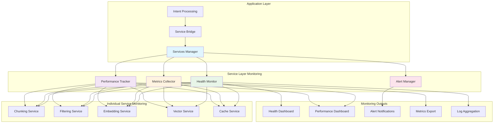

<!--
SPDX-FileCopyrightText: 2025 Knitli Inc.

SPDX-License-Identifier: MIT OR Apache-2.0
-->

# Service Monitoring

!!! tip "Production-Ready Observability"
    CodeWeaver's monitoring system provides comprehensive observability into service health, performance metrics, and system behavior for production deployments.

CodeWeaver's service monitoring system provides enterprise-grade observability with real-time health tracking, performance metrics, alerting, and comprehensive dashboards for all service layer components.

## Monitoring Architecture

### **Multi-Level Monitoring**



## Real-Time Health Monitoring

### **Service Health States**

Each service reports its health in real-time with detailed status information:

```python
from enum import Enum
from dataclasses import dataclass
from datetime import datetime

class HealthStatus(Enum):
    HEALTHY = "healthy"           # Service operating normally
    DEGRADED = "degraded"         # Service operational but performance impacted
    UNHEALTHY = "unhealthy"       # Service has significant issues
    UNKNOWN = "unknown"           # Health status cannot be determined
    MAINTENANCE = "maintenance"   # Service temporarily offline for maintenance

@dataclass
class DetailedHealthReport:
    service_name: str
    status: HealthStatus
    last_check: datetime
    response_time: float
    success_rate: float
    error_count: int
    uptime: float
    
    # Service-specific metrics
    performance_metrics: dict[str, float]
    resource_usage: dict[str, float]
    error_details: list[str]
    
    # Operational metadata
    version: str
    configuration_hash: str
    last_restart: datetime
    dependencies: list[str]
```

### **Continuous Health Monitoring**

```python
class ServiceHealthMonitor:
    def __init__(self, check_interval: float = 30.0):
        self.check_interval = check_interval
        self.health_history: dict[str, list[DetailedHealthReport]] = {}
        self.alert_thresholds = self._load_alert_thresholds()

    async def start_monitoring(self):
        """Start continuous health monitoring for all services."""
        while True:
            try:
                health_reports = await self._check_all_services()
                await self._process_health_reports(health_reports)
                await self._check_alert_conditions(health_reports)
                await asyncio.sleep(self.check_interval)
            except Exception as e:
                logger.exception("Health monitoring error: %s", e)

    async def _check_service_health(self, service: ServiceProvider) -> DetailedHealthReport:
        """Perform comprehensive health check on a service."""
        start_time = time.time()
        
        try:
            # Basic health check
            basic_health = await service.health_check()
            
            # Performance metrics
            performance_metrics = await self._collect_performance_metrics(service)
            
            # Resource usage
            resource_usage = await self._collect_resource_usage(service)
            
            # Error analysis
            error_details = await self._analyze_recent_errors(service)
            
            return DetailedHealthReport(
                service_name=service.service_name,
                status=basic_health.status,
                last_check=datetime.now(),
                response_time=time.time() - start_time,
                success_rate=basic_health.success_rate,
                error_count=basic_health.error_count,
                uptime=await self._calculate_uptime(service),
                performance_metrics=performance_metrics,
                resource_usage=resource_usage,
                error_details=error_details,
                version=service.version,
                configuration_hash=service.config_hash,
                last_restart=service.last_restart_time,
                dependencies=service.dependencies
            )
            
        except Exception as e:
            return DetailedHealthReport(
                service_name=service.service_name,
                status=HealthStatus.UNKNOWN,
                last_check=datetime.now(),
                response_time=time.time() - start_time,
                success_rate=0.0,
                error_count=1,
                uptime=0.0,
                performance_metrics={},
                resource_usage={},
                error_details=[str(e)],
                version="unknown",
                configuration_hash="unknown",
                last_restart=datetime.min,
                dependencies=[]
            )
```

## Performance Metrics Collection

### **Service-Specific Metrics**

Each service type collects specialized performance metrics:

=== "Chunking Service Metrics"
    ```python
    class ChunkingServiceMetrics:
        # Processing metrics
        files_processed_per_second: float
        chunks_generated_per_second: float
        average_chunk_size: float
        ast_parsing_success_rate: float
        fallback_parsing_usage: float
        
        # Performance metrics
        processing_latency_p50: float
        processing_latency_p95: float
        processing_latency_p99: float
        memory_usage_per_file: float
        cpu_usage_percentage: float
        
        # Quality metrics
        chunk_quality_score: float
        semantic_coherence_score: float
        overlap_efficiency: float
    ```

=== "Filtering Service Metrics"
    ```python
    class FilteringServiceMetrics:
        # Discovery metrics
        files_discovered_per_second: float
        directories_scanned_per_second: float
        gitignore_rules_applied: int
        custom_filters_applied: int
        
        # Performance metrics
        scanning_latency_p50: float
        scanning_latency_p95: float
        parallel_scanning_efficiency: float
        cache_hit_rate: float
        
        # Quality metrics
        false_positive_rate: float
        false_negative_rate: float
        filter_accuracy: float
    ```

=== "Embedding Service Metrics"
    ```python
    class EmbeddingServiceMetrics:
        # Processing metrics
        embeddings_generated_per_second: float
        tokens_processed_per_second: float
        batch_processing_efficiency: float
        provider_response_time: float
        
        # Quality metrics
        embedding_quality_score: float
        semantic_consistency_score: float
        provider_availability: float
        
        # Resource metrics
        api_calls_per_minute: float
        token_usage_rate: float
        cost_per_embedding: float
    ```

=== "Vector Service Metrics"
    ```python
    class VectorServiceMetrics:
        # Storage metrics
        vectors_stored_per_second: float
        storage_utilization: float
        index_size_mb: float
        storage_compression_ratio: float
        
        # Query metrics
        queries_per_second: float
        query_latency_p50: float
        query_latency_p95: float
        query_accuracy: float
        
        # Backend metrics
        backend_availability: float
        connection_pool_usage: float
        replication_lag: float
    ```

### **System-Wide Metrics**

```python
class SystemMetrics:
    # Overall system health
    overall_system_health: HealthStatus
    services_healthy_count: int
    services_degraded_count: int
    services_unhealthy_count: int
    
    # Performance aggregates
    total_requests_per_second: float
    average_response_time: float
    total_error_rate: float
    cache_hit_rate_overall: float
    
    # Resource utilization
    total_memory_usage_mb: float
    total_cpu_usage_percentage: float
    disk_usage_percentage: float
    network_io_rate: float
    
    # Business metrics
    codebases_indexed_today: int
    intent_queries_processed_today: int
    unique_users_today: int
    average_user_satisfaction: float
```

## Alerting and Notifications

### **Alert Configuration**

```yaml
# Alert configuration
alerting:
  channels:
    - type: slack
      webhook_url: "${SLACK_WEBHOOK_URL}"
      channel: "#codeweaver-alerts"
    
    - type: email
      smtp_host: "${SMTP_HOST}"
      recipients:
        - "ops@company.com"
        - "codeweaver-team@company.com"
    
    - type: pagerduty
      integration_key: "${PAGERDUTY_KEY}"
      severity_mapping:
        critical: "critical"
        warning: "warning"
        info: "info"

  rules:
    # Service health alerts
    - name: "Service Unhealthy"
      condition: "service.status == 'unhealthy'"
      severity: "critical"
      threshold_duration: "2m"
      
    - name: "Service Degraded"
      condition: "service.status == 'degraded'"
      severity: "warning"
      threshold_duration: "5m"
    
    # Performance alerts
    - name: "High Response Time"
      condition: "service.response_time > 5.0"
      severity: "warning"
      threshold_duration: "3m"
    
    - name: "Low Success Rate"
      condition: "service.success_rate < 0.95"
      severity: "critical"
      threshold_duration: "1m"
    
    # Resource alerts
    - name: "High Memory Usage"
      condition: "system.memory_usage > 85%"
      severity: "warning"
      threshold_duration: "5m"
    
    - name: "High CPU Usage"
      condition: "system.cpu_usage > 90%"
      severity: "critical"
      threshold_duration: "2m"
```

### **Smart Alert Management**

```python
class SmartAlertManager:
    def __init__(self):
        self.alert_history: dict[str, list[Alert]] = {}
        self.suppression_rules: list[SuppressionRule] = []
        self.escalation_policies: dict[str, EscalationPolicy] = {}

    async def process_alert(self, alert: Alert):
        """Process an alert with smart filtering and escalation."""
        
        # Check if alert should be suppressed
        if await self._should_suppress_alert(alert):
            logger.info("Alert suppressed: %s", alert.name)
            return
        
        # Apply alert grouping
        grouped_alert = await self._group_with_related_alerts(alert)
        
        # Determine escalation level
        escalation_level = await self._calculate_escalation_level(grouped_alert)
        
        # Send notifications
        await self._send_notifications(grouped_alert, escalation_level)
        
        # Update alert history
        await self._update_alert_history(grouped_alert)

    async def _should_suppress_alert(self, alert: Alert) -> bool:
        """Determine if alert should be suppressed based on rules."""
        
        # Check maintenance windows
        if await self._is_in_maintenance_window(alert.service_name):
            return True
        
        # Check alert frequency limits
        if await self._exceeds_frequency_limit(alert):
            return True
        
        # Check dependency-based suppression
        if await self._has_upstream_failure(alert):
            return True
        
        return False

    async def _group_with_related_alerts(self, alert: Alert) -> GroupedAlert:
        """Group related alerts to reduce noise."""
        related_alerts = await self._find_related_alerts(alert)
        
        if related_alerts:
            return GroupedAlert(
                primary_alert=alert,
                related_alerts=related_alerts,
                group_id=self._generate_group_id(alert, related_alerts),
                severity=max(a.severity for a in [alert] + related_alerts)
            )
        
        return GroupedAlert(primary_alert=alert, related_alerts=[], group_id=alert.id, severity=alert.severity)
```

## Monitoring Dashboards

### **Real-Time Health Dashboard**

The health dashboard provides real-time visibility into system status:

```typescript
// Health dashboard data structure
interface HealthDashboardData {
  // Overall system status
  systemStatus: {
    status: HealthStatus;
    lastUpdate: Date;
    uptime: number;
    version: string;
  };
  
  // Service health grid
  services: Array<{
    name: string;
    status: HealthStatus;
    responseTime: number;
    successRate: number;
    lastCheck: Date;
    trend: 'improving' | 'stable' | 'degrading';
  }>;
  
  // Key metrics
  keyMetrics: {
    totalRequestsPerSecond: number;
    averageResponseTime: number;
    errorRate: number;
    cacheHitRate: number;
  };
  
  // Active alerts
  activeAlerts: Array<{
    id: string;
    severity: 'critical' | 'warning' | 'info';
    message: string;
    timestamp: Date;
    service: string;
  }>;
  
  // Resource utilization
  resources: {
    memory: { used: number; total: number; percentage: number };
    cpu: { usage: number; cores: number };
    disk: { used: number; total: number; percentage: number };
    network: { inbound: number; outbound: number };
  };
}
```

### **Performance Analytics Dashboard**

```typescript
interface PerformanceDashboardData {
  // Time series data
  timeSeriesMetrics: {
    timestamps: Date[];
    responseTime: number[];
    throughput: number[];
    errorRate: number[];
    resourceUsage: number[];
  };
  
  // Service performance breakdown
  servicePerformance: Array<{
    service: string;
    latencyP50: number;
    latencyP95: number;
    latencyP99: number;
    throughput: number;
    errorRate: number;
    trend: 'improving' | 'stable' | 'degrading';
  }>;
  
  // Performance insights
  insights: Array<{
    type: 'bottleneck' | 'optimization' | 'anomaly';
    service: string;
    description: string;
    impact: 'high' | 'medium' | 'low';
    recommendation: string;
  }>;
  
  // SLA compliance
  slaCompliance: {
    availability: { target: number; actual: number; status: 'met' | 'missed' };
    responseTime: { target: number; actual: number; status: 'met' | 'missed' };
    errorRate: { target: number; actual: number; status: 'met' | 'missed' };
  };
}
```

## Metrics Export and Integration

### **Prometheus Integration**

```python
from prometheus_client import Counter, Histogram, Gauge, start_http_server

class PrometheusMetricsExporter:
    def __init__(self):
        # Service counters
        self.intent_queries_total = Counter(
            'codeweaver_intent_queries_total',
            'Total number of intent queries processed',
            ['intent_type', 'status']
        )
        
        self.service_requests_total = Counter(
            'codeweaver_service_requests_total',
            'Total number of service requests',
            ['service', 'method', 'status']
        )
        
        # Service histograms
        self.service_response_time = Histogram(
            'codeweaver_service_response_time_seconds',
            'Service response time distribution',
            ['service', 'method']
        )
        
        self.intent_processing_time = Histogram(
            'codeweaver_intent_processing_time_seconds',
            'Intent processing time distribution',
            ['intent_type']
        )
        
        # Service gauges
        self.service_health_status = Gauge(
            'codeweaver_service_health_status',
            'Service health status (1=healthy, 0=unhealthy)',
            ['service']
        )
        
        self.active_connections = Gauge(
            'codeweaver_active_connections',
            'Number of active connections',
            ['service']
        )

    async def export_service_metrics(self, health_report: DetailedHealthReport):
        """Export service metrics to Prometheus."""
        service_name = health_report.service_name
        
        # Update health status
        health_value = 1.0 if health_report.status == HealthStatus.HEALTHY else 0.0
        self.service_health_status.labels(service=service_name).set(health_value)
        
        # Update response time
        self.service_response_time.labels(
            service=service_name,
            method='health_check'
        ).observe(health_report.response_time)
        
        # Update request counters
        status = 'success' if health_report.status == HealthStatus.HEALTHY else 'error'
        self.service_requests_total.labels(
            service=service_name,
            method='health_check',
            status=status
        ).inc()
```

### **OpenTelemetry Integration**

```python
from opentelemetry import trace, metrics
from opentelemetry.exporter.otlp.proto.grpc.trace_exporter import OTLPSpanExporter
from opentelemetry.exporter.otlp.proto.grpc.metric_exporter import OTLPMetricExporter

class OpenTelemetryMonitoring:
    def __init__(self):
        self.tracer = trace.get_tracer(__name__)
        self.meter = metrics.get_meter(__name__)
        
        # Create metrics instruments
        self.intent_counter = self.meter.create_counter(
            "codeweaver.intent.processed",
            description="Number of intents processed"
        )
        
        self.service_latency = self.meter.create_histogram(
            "codeweaver.service.latency",
            description="Service operation latency",
            unit="ms"
        )

    async def trace_intent_processing(self, intent: str, intent_type: str):
        """Trace intent processing with distributed tracing."""
        with self.tracer.start_as_current_span("process_intent") as span:
            span.set_attribute("intent.type", intent_type)
            span.set_attribute("intent.query", intent[:100])  # Truncate for privacy
            
            try:
                # Process intent
                result = await self._process_intent_impl(intent, intent_type)
                
                span.set_attribute("intent.status", "success")
                span.set_attribute("intent.result_count", len(result.items))
                
                # Record metrics
                self.intent_counter.add(1, {"type": intent_type, "status": "success"})
                
                return result
                
            except Exception as e:
                span.set_attribute("intent.status", "error")
                span.set_attribute("intent.error", str(e))
                span.record_exception(e)
                
                # Record error metrics
                self.intent_counter.add(1, {"type": intent_type, "status": "error"})
                
                raise e
```

## Monitoring Configuration

### **Environment-Based Configuration**

```bash
# Core monitoring settings
CW_MONITORING_ENABLED=true
CW_MONITORING_CHECK_INTERVAL=30
CW_MONITORING_RETENTION_DAYS=30

# Health check settings
CW_HEALTH_CHECK_TIMEOUT=10
CW_HEALTH_CHECK_RETRIES=3
CW_HEALTH_CHECK_BACKOFF=2

# Alerting settings
CW_ALERTS_ENABLED=true
CW_ALERTS_SLACK_WEBHOOK=https://hooks.slack.com/...
CW_ALERTS_EMAIL_SMTP_HOST=smtp.company.com
CW_ALERTS_EMAIL_RECIPIENTS=ops@company.com,team@company.com

# Metrics export settings
CW_METRICS_PROMETHEUS_ENABLED=true
CW_METRICS_PROMETHEUS_PORT=9090
CW_METRICS_OTEL_ENABLED=true
CW_METRICS_OTEL_ENDPOINT=http://jaeger:14268/api/traces
```

### **Production Monitoring Recommendations**

```yaml
# Production monitoring configuration
monitoring:
  health_checks:
    interval: 15s
    timeout: 5s
    retries: 2
    
  metrics_collection:
    interval: 10s
    retention: 7d
    aggregation_interval: 1m
    
  alerting:
    response_time_threshold: 2s
    error_rate_threshold: 1%
    health_check_failures: 3
    
  dashboards:
    refresh_interval: 5s
    auto_refresh: true
    real_time_updates: true
```

## Next Steps

<div class="grid cards" markdown>

-   :material-autorenew: **[Health Checks & Auto-Recovery](health-recovery.md)**

    Automated failure detection and recovery mechanisms

-   :material-cog: **[Service Configuration](../configuration/services.md)**

    Advanced service configuration and performance tuning

-   :material-api: **[Health Monitoring API](../api/services/health.md)**

    Complete API reference for health monitoring

-   :material-chart-line: **[Performance Analysis](../tutorials/service-integration.md)**

    Advanced performance analysis and optimization techniques

</div>

---

**Next:** [Health Checks & Auto-Recovery →](health-recovery.md)