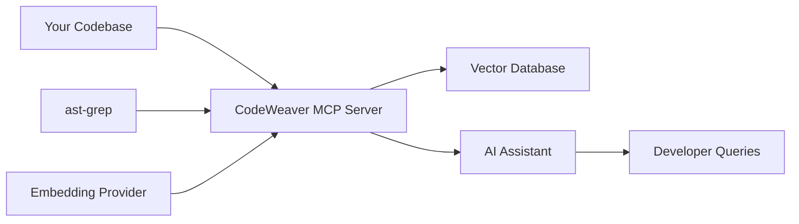

<!--
SPDX-FileCopyrightText: 2025 Knitli Inc.

SPDX-License-Identifier: MIT OR Apache-2.0
-->

# How CodeWeaver Works

**Seamless semantic code search for your development workflow**

CodeWeaver transforms how you explore and understand codebases by providing intelligent semantic search through your AI assistant. Rather than replacing your development tools, it enhances them by giving your AI assistant deep, contextual understanding of your code.

## Core Concept

CodeWeaver operates as a **Model Context Protocol (MCP) server** that sits between your AI assistant (like Claude) and your codebase. It provides four fundamental capabilities:

1. **Semantic Code Indexing** - Intelligently chunks and embeds your codebase
2. **Natural Language Search** - Find code using plain English descriptions
3. **Structural Pattern Matching** - Locate code patterns using ast-grep syntax
4. **Language-Aware Processing** - Support for 20+ programming languages

## The Development Workflow Integration

### Before CodeWeaver
```plaintext
Developer Question: "Where is user authentication handled?"
↓
Manual Process: Search files :material-arrow-right-circle: Read code :material-arrow-right-circle: Understand context :material-arrow-right-circle: Find related files
↓
Time: 10-30 minutes of manual exploration
```

### With CodeWeaver
```plaintext
Developer Question: "Where is user authentication handled?"
↓
AI Assistant + CodeWeaver: Semantic search + contextual understanding
↓
Result: Instant identification of auth files, middleware, and related components
↓
Time: 30 seconds with full context
```

## Architecture Overview



### Component Breakdown

**🔍 Intelligent Chunking**
- Uses ast-grep for language-aware code segmentation
- Respects function boundaries, class definitions, and logical code blocks
- Fallback parsing for unsupported languages
- Configurable chunk sizes (50-1500 characters)

**🧠 Semantic Understanding**
- Converts code chunks into high-dimensional embeddings
- Supports multiple providers: Voyage AI, OpenAI, Cohere, HuggingFace
- Enables semantic similarity searches beyond keyword matching

**⚡ Hybrid Search**
- Combines semantic embeddings with structural pattern matching
- Traditional search patterns through ast-grep integration
- Language-specific optimization for syntax and idioms

**🎯 Context-Aware Results**
- Returns code with surrounding context and metadata
- File path, language, and structural information included
- Ranked results based on semantic relevance

## Development Workflow Examples

### Code Exploration
```plaintext
Query: "How does error handling work in this API?"
↓
CodeWeaver finds:
- Exception middleware definitions
- Error response formatting
- Logging implementations
- Related test files
```

### Feature Development
```plaintext
Query: "Show me examples of database migrations"
↓
CodeWeaver locates:
- Migration file patterns
- Schema change examples
- Rollback implementations
- Testing strategies
```

### Debugging
```plaintext
Query: "Find code that processes payment webhooks"
↓
CodeWeaver identifies:
- Webhook endpoint handlers
- Payment processing logic
- Validation and security checks
- Related error logging
```

### Code Review
```plaintext
Query: "Show security patterns in authentication code"
↓
CodeWeaver highlights:
- Input validation examples
- Secure token handling
- Rate limiting implementations
- Audit logging patterns
```

## Language Support and Capabilities

### First-Class Support (Native Patterns)
Languages with optimized ast-grep patterns and structural understanding:

- **JavaScript/TypeScript** - React components, async patterns, module imports
- **Python** - Class definitions, decorators, async/await patterns
- **Rust** - Ownership patterns, trait implementations, error handling
- **Go** - Interface implementations, goroutine patterns, error handling

### Universal Support
All languages benefit from semantic search and basic structural parsing:

**Web Technologies**: HTML, CSS, Vue, Svelte, React TSX
**Systems Languages**: C/C++, C#, Zig
**JVM Languages**: Java, Kotlin, Scala
**Dynamic Languages**: Ruby, PHP, Swift, Dart
**Functional Languages**: Haskell, OCaml, Elm, Elixir, Erlang, Clojure
**Configuration**: JSON, YAML, TOML, XML, SQL
**Scripts**: Bash, PowerShell, Docker, Make, CMake

## Performance Characteristics

### Indexing Performance
- **Small Projects** (<1k files): 1-3 minutes
- **Medium Projects** (1k-10k files): 5-15 minutes
- **Large Projects** (10k+ files): 15+ minutes (depends on file size)

### Search Performance
- **Semantic Search**: 200-500ms average response time
- **Pattern Search**: 50-200ms average response time
- **Batch Operations**: Optimized for multiple concurrent searches

### Resource Usage
- **Memory**: ~100MB base + ~1MB per 1000 code chunks
- **Storage**: Vector embeddings ~2-5x source code size
- **Network**: API calls to embedding provider during indexing

## Integration Points

### AI Assistant Integration
CodeWeaver integrates with any MCP-compatible AI assistant:

- **Claude Desktop** - Primary integration target
- **Claude Code** - Enhanced development workflows
- **Custom MCP Clients** - Build your own integrations

### Development Tool Integration
Works alongside your existing tools:

- **IDEs** - Supplementary to built-in search and navigation
- **Git Workflows** - Understand changes across branches and commits
- **CI/CD** - Automated code analysis and documentation generation
- **Code Review** - Context-aware review assistance

### Data Source Flexibility
Extensible architecture supports multiple data sources:

- **Local Filesystem** - Direct file system access
- **Git Repositories** - Branch and commit-aware indexing
- **Remote APIs** - Integration with code hosting platforms
- **Databases** - Custom data source implementations

## What Makes CodeWeaver Different

### Traditional Code Search
- **Keyword-based** - Exact string matching
- **Syntax-aware** - Language-specific tokenization
- **Fast but limited** - Quick but requires knowing exact terms

### CodeWeaver's Semantic Search
- **Intent-based** - Understands what you're looking for conceptually
- **Context-aware** - Considers surrounding code and relationships
- **Language-neutral** - Works across different programming paradigms
- **Extensible** - Plugin architecture for custom providers and backends

### Best of Both Worlds
CodeWeaver combines semantic understanding with traditional pattern matching, giving you the speed of exact search with the intelligence of semantic understanding.

## Next Steps

Ready to integrate CodeWeaver into your development workflow?

- [**Quick Start Guide**](../getting-started/quick-start.md) - Get up and running in 5 minutes
- [**Claude Desktop Integration**](claude-desktop.md) - Detailed setup instructions
- [**Development Workflows**](workflows.md) - Practical usage examples
- [**Performance Optimization**](performance.md) - Production configuration tuning
