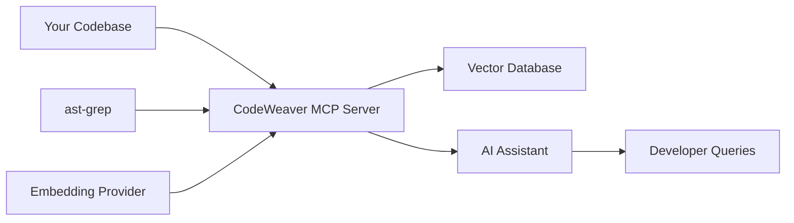

<!--
SPDX-FileCopyrightText: 2025 Knitli Inc.

SPDX-License-Identifier: MIT OR Apache-2.0
-->

# How CodeWeaver Works

**The first full-stack MCP platform: a powerful server, extensible framework, and natural language interface**

CodeWeaver transforms how you explore and understand codebases by providing intelligent semantic search through a natural language interface. Rather than replacing your development tools, it enhances them by giving your AI assistant deep, contextual understanding of your code.

## Core Concept

CodeWeaver operates as a **Model Context Protocol (MCP) server** that provides intelligent semantic code search through a natural language interface. Instead of individual tools, it uses an **intent-based architecture** where you describe what you want to accomplish, and CodeWeaver determines the best approach.

### Primary Interface
- **`process_intent`** - Natural language interface for all operations
- **`get_intent_capabilities`** - Discover what CodeWeaver can do

### Key Capabilities
1. **Automatic Background Indexing** - Codebases are indexed automatically when needed
2. **Natural Language Search** - Find code using plain English descriptions  
3. **Structural Pattern Matching** - Locate code patterns using ast-grep syntax
4. **Language-Aware Processing** - Support for 25+ programming languages

## The Development Workflow Integration

### Before CodeWeaver
```plaintext
Developer Question: "Where is user authentication handled?"
↓
Manual Process: Search files :material-arrow-right-circle: Read code :material-arrow-right-circle: Understand context :material-arrow-right-circle: Find related files
↓
Time: 10-30 minutes of manual exploration
```

### With CodeWeaver
```plaintext
Developer Question: "Where is user authentication handled?"
↓
AI Assistant + CodeWeaver: process_intent("find user authentication code")
↓
Result: Instant identification of auth files, middleware, and related components
↓
Time: 30 seconds with full context
```

## Architecture Overview



### Component Breakdown

**🔍 Intelligent Chunking**
- Uses ast-grep for language-aware code segmentation
- Respects function boundaries, class definitions, and logical code blocks
- Fallback parsing for unsupported languages
- Configurable chunk sizes (50-1500 characters)

**🧠 Semantic Understanding**
- Converts code chunks into high-dimensional embeddings
- Supports multiple providers: Voyage AI, OpenAI, Cohere, HuggingFace
- Enables semantic similarity searches beyond keyword matching

**⚡ Hybrid Search**
- Combines semantic embeddings with structural pattern matching
- Traditional search patterns through ast-grep integration
- Language-specific optimization for syntax and idioms

**🎯 Context-Aware Results**
- Returns code with surrounding context and metadata
- File path, language, and structural information included
- Ranked results based on semantic relevance

## Development Workflow Examples

### Code Exploration
```plaintext
Intent: "How does error handling work in this API?"
↓
CodeWeaver's process_intent analyzes and finds:
- Exception middleware definitions
- Error response formatting
- Logging implementations
- Related test files
```

### Feature Development
```plaintext
Intent: "Show me examples of database migrations"
↓
CodeWeaver's process_intent locates:
- Migration file patterns
- Schema change examples
- Rollback implementations
- Testing strategies
```

### Debugging
```plaintext
Intent: "Find code that processes payment webhooks"
↓
CodeWeaver's process_intent identifies:
- Webhook endpoint handlers
- Payment processing logic
- Validation and security checks
- Related error logging
```

### Code Review
```plaintext
Intent: "Show security patterns in authentication code"
↓
CodeWeaver's process_intent highlights:
- Input validation examples
- Secure token handling
- Rate limiting implementations
- Audit logging patterns
```

## Language Support and Capabilities

### AST-Grep Supported Languages (Advanced Parsing)
Languages with native ast-grep support for structural understanding:

**Programming Languages**: Python, JavaScript, TypeScript, Java, C#, C/C++, Rust, Go, PHP, Ruby, Swift, Kotlin, Scala
**Web Technologies**: HTML, CSS, JSX, TSX  
**Configuration**: JSON, YAML
**Systems**: Bash, Haskell, Elixir, Lua, Nix, Solidity

### Universal Support (Semantic Search)
All text-based files benefit from semantic search with basic structural parsing. Languages not in the AST-grep list still get intelligent chunking and semantic understanding.

## Performance Characteristics

CodeWeaver is designed for efficient operation with large codebases:

### Indexing Approach
- **Automatic Background Indexing** - Triggered when needed, not manual
- **Intelligent Chunking** - AST-aware segmentation for better context
- **Configurable Limits** - Skip large files (>1MB default), respect gitignore

### Search Optimization
- **Hybrid Approach** - Combines semantic similarity with structural patterns
- **Batch Processing** - Efficient handling of multiple files
- **Smart Filtering** - File type, language, and directory-based filtering

### Resource Management
- **Memory Efficient** - Configurable chunk sizes and batch processing
- **Storage** - Vector embeddings stored in your chosen backend
- **Network** - API calls only to your configured embedding provider

## Integration Points

### AI Assistant Integration
CodeWeaver integrates with any MCP-compatible AI assistant:

- **Claude Desktop** - Primary integration target with natural language interface
- **Claude Code** - Enhanced development workflows through intent processing
- **Other MCP Clients** - Any client supporting the MCP protocol

### Development Tool Integration
Works alongside your existing tools:

- **IDEs** - Supplementary to built-in search and navigation
- **Git Workflows** - Understands repository structure and changes
- **Command Line** - Comprehensive CLI for direct developer interaction
- **Code Review** - Context-aware assistance through AI integration

### Developer Tools

#### Command Line Interface
CodeWeaver provides extensive CLI commands for direct developer interaction:

```bash
# Service management
codeweaver services start          # Start all services  
codeweaver services status         # Check service health
codeweaver index start            # Start auto-indexing

# Testing and diagnostics
codeweaver client test <server>   # Test MCP connection
codeweaver health                 # Quick health check
codeweaver config generate        # Generate configuration
```

### Data Source Flexibility
Extensible architecture supports multiple data sources:

- **Local Filesystem** - Direct file system access with intelligent filtering
- **Git Integration** - Repository-aware indexing with gitignore support
- **Extensible Plugin System** - Factory pattern for custom data sources
- **Configuration-Driven** - Easy setup through TOML configuration files

## What Makes CodeWeaver Different

### Traditional Code Search
- **Keyword-based** - Exact string matching
- **Syntax-aware** - Language-specific tokenization
- **Fast but limited** - Quick but requires knowing exact terms

### CodeWeaver's Approach
- **Intent-based Interface** - Natural language descriptions of what you need
- **Context-aware Analysis** - Understands code relationships and structure
- **Language-neutral Semantic Search** - Works across programming paradigms
- **Extensible Architecture** - Plugin system for providers, backends, and sources
- **Automatic Background Processing** - No manual indexing workflows required

### Best of Both Worlds
CodeWeaver combines semantic understanding with structural pattern matching through a unified natural language interface, giving you conceptual search power with the precision of structural queries.

## Privacy and Telemetry

CodeWeaver includes optional usage analytics to help improve the platform. For complete information about data collection and privacy, see our [telemetry documentation](../getting-started/telemetry.md).

## Next Steps

Ready to integrate CodeWeaver into your development workflow?

- [**Quick Start Guide**](../getting-started/quick-start.md) - Get up and running in 5 minutes
- [**Claude Desktop Integration**](claude-desktop.md) - Detailed setup instructions
- [**Development Workflows**](workflows.md) - Practical usage examples
- [**Performance Optimization**](performance.md) - Production configuration tuning
