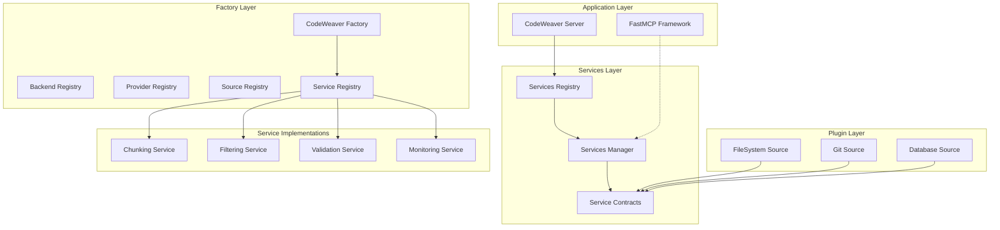

<!--
SPDX-FileCopyrightText: 2025 Knitli Inc.

SPDX-License-Identifier: MIT OR Apache-2.0
-->

# Services Registry & Abstraction Layer Architecture Specification

**CodeWeaver MCP Server - Services Architecture Design**

*Document Version: 1.0*
*Design Date: 2025-07-26*
*Architecture Type: Clean Implementation (Pre-Release)*
*Focus Areas: Services Registry, Dependency Injection, Factory Integration*

---

## Executive Summary

This specification defines a comprehensive services registry and abstraction layer for CodeWeaver that eliminates direct middleware dependencies, extends the factory pattern to services, and provides clean dependency injection throughout the plugin architecture.

**Key Design Principles:**
- 🏗️ **Clean Architecture**: No legacy cruft or migration code
- 🔄 **Pure Dependency Injection**: Services injected through factory system
- 📋 **Service Contracts**: Protocol-based interfaces for all services
- ⚙️ **Unified Configuration**: Consistent service configuration patterns
- 🔌 **Extensible Design**: Easy addition of new services and providers

---

## Architecture Overview

### Current State Problems
- Direct middleware dependencies in plugins (e.g., `filesystem.py` imports `ChunkingMiddleware`)
- Factory pattern violations (middleware not factory-managed)
- Inconsistent service configuration between server and plugin layers
- Hard-coded service instantiation preventing proper testing and extensibility

### Proposed Solution Architecture



---

## Core Components

### 1. Service Contracts (Protocol Interfaces)

**Location:** `src/codeweaver/_types/services.py`

Service contracts define the interface between plugins and service implementations, enabling dependency injection and service substitution.

```python
from typing import Protocol, runtime_checkable
from pathlib import Path
from codeweaver.types import CodeChunk, ContentItem

@runtime_checkable
class ChunkingService(Protocol):
    """Protocol for content chunking services."""

    async def chunk_content(
        self,
        content: str,
        file_path: Path,
        metadata: dict[str, Any] = None
    ) -> list[CodeChunk]: ...

    def get_supported_languages(self) -> dict[str, LanguageCapabilities]: ...
    def detect_language(self, file_path: Path) -> str | None: ...
    def get_language_config(self, language: str) -> LanguageConfig | None: ...

@runtime_checkable
class FilteringService(Protocol):
    """Protocol for content filtering and discovery services."""

    async def discover_files(
        self,
        base_path: Path,
        patterns: list[str] = None,
        exclude_patterns: list[str] = None
    ) -> list[Path]: ...

    def should_include_file(self, file_path: Path) -> bool: ...
    def get_file_metadata(self, file_path: Path) -> FileMetadata: ...
    def get_filtering_stats(self) -> FilteringStats: ...

@runtime_checkable
class ValidationService(Protocol):
    """Protocol for content validation services."""

    async def validate_content(self, content: ContentItem) -> ValidationResult: ...
    async def validate_chunk(self, chunk: CodeChunk) -> ValidationResult: ...
    def get_validation_rules(self) -> list[ValidationRule]: ...

@runtime_checkable
class CacheService(Protocol):
    """Protocol for caching services."""

    async def get(self, key: str) -> Any | None: ...
    async def set(self, key: str, value: Any, ttl: int = None) -> None: ...
    async def invalidate(self, pattern: str) -> None: ...
    async def clear(self) -> None: ...
```

### 2. Service Registry

**Location:** `src/codeweaver/factories/service_registry.py`

The service registry manages service providers, configurations, and instance creation through the factory pattern.

```python
class ServiceRegistry:
    """Registry for service providers and instance management."""

    def __init__(self, factory: 'CodeWeaverFactory'):
        self._factory = factory
        self._providers: dict[ServiceType, dict[str, ServiceProvider]] = {}
        self._instances: dict[str, Any] = {}
        self._configs: dict[ServiceType, ServiceConfig] = {}

    def register_provider(
        self,
        service_type: ServiceType,
        provider_name: str,
        provider_class: type[ServiceProvider]
    ) -> None: ...

    def get_service(self, service_type: ServiceType) -> Any: ...

    def create_service(
        self,
        service_type: ServiceType,
        config: ServiceConfig = None
    ) -> Any: ...

    def configure_service(
        self,
        service_type: ServiceType,
        config: ServiceConfig
    ) -> None: ...
```

### 3. Services Manager

**Location:** `src/codeweaver/services/services_manager.py`

The services manager orchestrates service lifecycle, dependency resolution, and health monitoring.

```python
class ServicesManager:
    """Central manager for service lifecycle and dependencies."""

    def __init__(self, registry: ServiceRegistry, config: ServicesConfig):
        self._registry = registry
        self._config = config
        self._health_monitor = ServiceHealthMonitor()
        self._dependency_resolver = ServiceDependencyResolver()

    async def initialize_services(self) -> None: ...
    async def start_services(self) -> None: ...
    async def stop_services(self) -> None: ...

    def get_service(self, service_type: ServiceType) -> Any: ...
    def inject_dependencies(self, target: Any) -> None: ...

    async def health_check(self) -> ServicesHealthReport: ...
```

### 4. Service Providers

**Location:** `src/codeweaver/services/providers/`

Service providers implement the actual service functionality while conforming to service contracts.

```python
class ChunkingServiceProvider(ServiceProvider):
    """FastMCP middleware-based chunking service provider."""

    def __init__(self, config: ChunkingServiceConfig):
        self._middleware = ChunkingMiddleware(config.middleware_config)
        self._config = config

    async def chunk_content(
        self,
        content: str,
        file_path: Path,
        metadata: dict[str, Any] = None
    ) -> list[CodeChunk]:
        # Implementation using FastMCP middleware
        return await self._middleware.chunk_content(content, file_path, metadata)

class FilteringServiceProvider(ServiceProvider):
    """FastMCP middleware-based filtering service provider."""

    def __init__(self, config: FilteringServiceConfig):
        self._middleware = FilteringMiddleware(config.middleware_config)
        self._config = config

    async def discover_files(
        self,
        base_path: Path,
        patterns: list[str] = None,
        exclude_patterns: list[str] = None
    ) -> list[Path]:
        # Implementation using FastMCP middleware
        return await self._middleware.discover_files(base_path, patterns, exclude_patterns)
```

---

## Integration with Factory System

### Extended ComponentType Enum

**Location:** `src/codeweaver/_types/config.py`

```python
class ComponentType(BaseEnum):
    BACKEND = "backend"
    PROVIDER = "provider"
    SOURCE = "source"
    SERVICE = "service"      # NEW: For service providers
    MIDDLEWARE = "middleware" # NEW: For middleware components
    FACTORY = "factory"
    PLUGIN = "plugin"
```

### Extended CodeWeaverFactory

**Location:** `src/codeweaver/factories/codeweaver_factory.py`

```python
class CodeWeaverFactory:
    """Extended factory with service management capabilities."""

    def __init__(self):
        # Existing registries
        self._backend_registry = BackendRegistry(self)
        self._provider_registry = ProviderRegistry(self)
        self._source_registry = SourceRegistry(self)

        # NEW: Service registry
        self._service_registry = ServiceRegistry(self)
        self._services_manager = None

    def create_service(
        self,
        service_type: ServiceType,
        config: ServiceConfig = None
    ) -> Any:
        """Create service instance through registry."""
        return self._service_registry.create_service(service_type, config)

    def get_services_manager(self) -> ServicesManager:
        """Get or create services manager."""
        if not self._services_manager:
            self._services_manager = ServicesManager(
                self._service_registry,
                self._config.services
            )
        return self._services_manager

    async def initialize_services(self) -> None:
        """Initialize all configured services."""
        manager = self.get_services_manager()
        await manager.initialize_services()
```

---

## Configuration Architecture

### Service Configuration Schema

**Location:** `src/codeweaver/_types/service_config.py`

```python
class ServiceConfig(BaseModel):
    """Base configuration for all services."""

    enabled: Annotated[bool, Field(description="Whether service is enabled")] = True
    provider: Annotated[str, Field(description="Service provider implementation")]
    priority: Annotated[int, Field(ge=0, le=100, description="Service priority")] = 50
    timeout: Annotated[float, Field(gt=0, description="Service timeout in seconds")] = 30.0
    retry_config: Annotated[RetryConfig, Field(description="Retry configuration")] = Field(default_factory=RetryConfig)
    health_check: Annotated[HealthCheckConfig, Field(description="Health check config")] = Field(default_factory=HealthCheckConfig)

class ChunkingServiceConfig(ServiceConfig):
    """Configuration for chunking services."""

    provider: str = "fastmcp_chunking"
    max_chunk_size: Annotated[int, Field(gt=0, le=10000)] = 1500
    min_chunk_size: Annotated[int, Field(gt=0, le=1000)] = 50
    ast_grep_enabled: Annotated[bool, Field(description="Enable AST-based chunking")] = True
    language_detection: Annotated[LanguageDetectionConfig, Field(description="Language detection config")] = Field(default_factory=LanguageDetectionConfig)

class FilteringServiceConfig(ServiceConfig):
    """Configuration for filtering services."""

    provider: str = "fastmcp_filtering"
    include_patterns: Annotated[list[str], Field(description="File patterns to include")] = Field(default_factory=list)
    exclude_patterns: Annotated[list[str], Field(description="File patterns to exclude")] = Field(default_factory=list)
    max_file_size: Annotated[int, Field(gt=0, description="Max file size in bytes")] = 1024 * 1024  # 1MB
    follow_symlinks: Annotated[bool, Field(description="Follow symbolic links")] = False

class ServicesConfig(BaseModel):
    """Root configuration for all services."""

    chunking: Annotated[ChunkingServiceConfig, Field(description="Chunking service config")] = Field(default_factory=ChunkingServiceConfig)
    filtering: Annotated[FilteringServiceConfig, Field(description="Filtering service config")] = Field(default_factory=FilteringServiceConfig)
    validation: Annotated[ValidationServiceConfig, Field(description="Validation service config")] = Field(default_factory=ValidationServiceConfig)
    cache: Annotated[CacheServiceConfig, Field(description="Cache service config")] = Field(default_factory=CacheServiceConfig)
```

### Configuration Integration

**Location:** `src/codeweaver/config.py`

```python
class CodeWeaverConfig(BaseModel):
    """Extended root configuration with services."""

    # Existing configurations
    embedding: EmbeddingConfig = Field(default_factory=EmbeddingConfig)
    vector_backend: VectorBackendConfig = Field(default_factory=VectorBackendConfig)

    # NEW: Services configuration
    services: ServicesConfig = Field(default_factory=ServicesConfig)

    # Factory configuration
    factory: FactoryConfig = Field(default_factory=FactoryConfig)
```

---

## Dependency Injection Architecture

### Service Injection in Plugins

**Location:** `src/codeweaver/sources/filesystem.py` (Clean Implementation)

```python
class FileSystemSource(AbstractDataSource):
    """Clean filesystem source with service injection."""

    def __init__(
        self,
        config: FileSystemSourceConfig,
        chunking_service: ChunkingService,
        filtering_service: FilteringService,
        validation_service: ValidationService | None = None
    ):
        super().__init__(config)
        self._chunking_service = chunking_service
        self._filtering_service = filtering_service
        self._validation_service = validation_service

    async def index_content(
        self,
        path: Path,
        context: dict[str, Any] = None
    ) -> list[ContentItem]:
        """Index content using injected services."""

        # Use filtering service to discover files
        files = await self._filtering_service.discover_files(
            path,
            self.config.include_patterns,
            self.config.exclude_patterns
        )

        content_items = []
        for file_path in files:
            if not self._filtering_service.should_include_file(file_path):
                continue

            # Read and chunk content using chunking service
            content = await self._read_file_content(file_path)
            chunks = await self._chunking_service.chunk_content(
                content,
                file_path,
                context
            )

            # Optional validation
            if self._validation_service:
                for chunk in chunks:
                    validation_result = await self._validation_service.validate_chunk(chunk)
                    if not validation_result.is_valid:
                        # Handle validation failure
                        continue

            content_items.extend(chunks)

        return content_items
```

### Factory-Based Plugin Creation

**Location:** `src/codeweaver/factories/source_registry.py` (Updated)

```python
class SourceRegistry:
    """Updated source registry with service injection."""

    def create_source(
        self,
        source_type: SourceType,
        config: SourceConfig
    ) -> AbstractDataSource:
        """Create source with injected services."""

        # Get required services from services manager
        services_manager = self._factory.get_services_manager()

        chunking_service = services_manager.get_service(ServiceType.CHUNKING)
        filtering_service = services_manager.get_service(ServiceType.FILTERING)
        validation_service = services_manager.get_service(ServiceType.VALIDATION)

        # Create source with service injection
        if source_type == SourceType.FILESYSTEM:
            return FileSystemSource(
                config=config,
                chunking_service=chunking_service,
                filtering_service=filtering_service,
                validation_service=validation_service
            )
        # ... other source types
```

---

## Service Lifecycle Management

### Initialization Sequence

```python
class CodeWeaverServer:
    """Server with proper service lifecycle management."""

    async def initialize(self) -> None:
        """Initialize server with services."""

        # 1. Initialize factory
        self._factory = CodeWeaverFactory()

        # 2. Load configuration
        config = await self._load_configuration()
        self._factory.configure(config)

        # 3. Initialize services BEFORE plugins
        await self._factory.initialize_services()

        # 4. Initialize plugins with service injection
        await self._initialize_plugins()

        # 5. Setup FastMCP middleware
        await self._setup_middleware()

    async def _setup_middleware(self) -> None:
        """Setup FastMCP middleware integrated with services."""

        services_manager = self._factory.get_services_manager()

        # Middleware uses services through manager
        chunking_service = services_manager.get_service(ServiceType.CHUNKING)
        filtering_service = services_manager.get_service(ServiceType.FILTERING)

        # Create middleware that wraps services
        chunking_middleware = ServiceMiddleware(chunking_service)
        filtering_middleware = ServiceMiddleware(filtering_service)

        # Add to FastMCP
        self.mcp.add_middleware(chunking_middleware)
        self.mcp.add_middleware(filtering_middleware)
```

### Health Monitoring

```python
class ServiceHealthMonitor:
    """Service health monitoring and recovery."""

    async def monitor_services(self, services_manager: ServicesManager) -> None:
        """Continuous service health monitoring."""

        while True:
            health_report = await services_manager.health_check()

            for service_type, health in health_report.services.items():
                if health.status == HealthStatus.UNHEALTHY:
                    await self._handle_unhealthy_service(service_type, health)

            await asyncio.sleep(self._config.check_interval)

    async def _handle_unhealthy_service(
        self,
        service_type: ServiceType,
        health: ServiceHealth
    ) -> None:
        """Handle unhealthy service recovery."""

        if health.error_count > self._config.max_errors:
            # Restart service
            await self._restart_service(service_type)
        else:
            # Log warning and continue monitoring
            logger.warning(
                "Service %s unhealthy: %s",
                service_type.value,
                health.last_error
            )
```

---

## Benefits of This Architecture

### 1. Clean Dependency Injection
- **Pure Factory Pattern**: All services created through factory system
- **Protocol-Based Contracts**: Clear interfaces enable easy testing and substitution
- **No Direct Dependencies**: Plugins never import middleware classes directly

### 2. Enhanced Extensibility
- **Service Provider Pattern**: Easy addition of new service implementations
- **Configuration-Driven**: Service behavior controlled through configuration
- **Plugin Independence**: Plugins work with any service implementation

### 3. Improved Testability
- **Service Mocking**: Easy to mock service interfaces for unit testing
- **Isolation Testing**: Each component can be tested independently
- **Dependency Control**: Test environments can use test-specific services

### 4. Operational Excellence
- **Health Monitoring**: Continuous service health checking and recovery
- **Performance Metrics**: Service-level performance monitoring
- **Configuration Validation**: Runtime validation of service configurations

### 5. Future-Proof Design
- **Service Discovery**: Ready for dynamic service discovery
- **Microservice Ready**: Architecture supports future microservice deployment
- **Plugin Ecosystem**: Foundation for external plugin development

---

## Implementation Roadmap

### Phase 1: Service Contracts & Registry (Week 1)
- [ ] Create service protocol interfaces
- [ ] Implement service registry infrastructure
- [ ] Extend factory system for services
- [ ] Update configuration schema

### Phase 2: Service Providers (Week 2)
- [ ] Implement chunking service provider
- [ ] Implement filtering service provider
- [ ] Create validation service provider
- [ ] Add cache service provider

### Phase 3: Plugin Integration (Week 3)
- [ ] Refactor filesystem source for dependency injection
- [ ] Update source registry for service injection
- [ ] Integrate services manager with server lifecycle
- [ ] Add comprehensive service testing

### Phase 4: Advanced Features (Week 4)
- [ ] Implement service health monitoring
- [ ] Add service performance metrics
- [ ] Create service discovery capabilities
- [ ] Add service configuration validation

---

## Conclusion

This services registry and abstraction layer architecture provides a clean, extensible, and maintainable foundation for CodeWeaver's service management. By eliminating direct dependencies and implementing proper dependency injection through the factory pattern, we achieve:

- **Architectural Consistency** with existing factory patterns
- **Enhanced Testability** through service mocking and isolation
- **Improved Extensibility** for future service additions
- **Operational Excellence** through health monitoring and configuration management

The clean implementation approach ensures no legacy debt while establishing patterns that will support CodeWeaver's growth and evolution.
